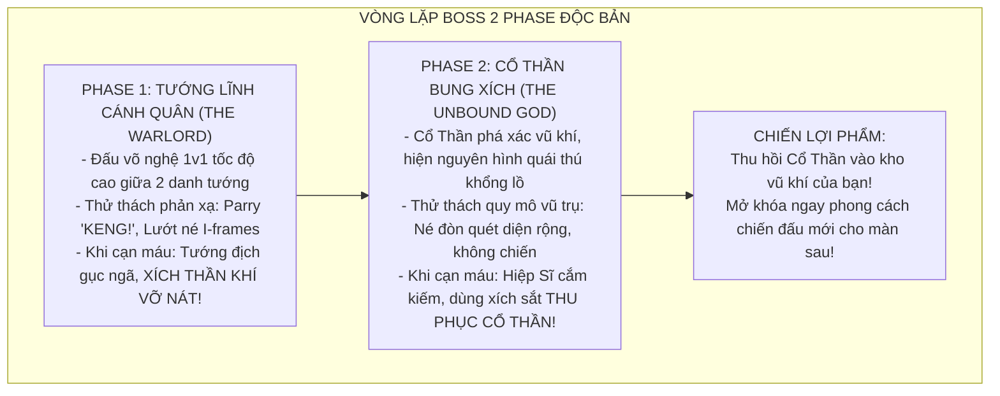

# TÀI LIỆU THIẾT KẾ GAME TOÀN DIỆN (COMPREHENSIVE GAME DESIGN DOCUMENT)
**Tên dự án:** *GODSHACKLE: PHƯỢC THẦN CHI TỎA (The Bound Divinity)*  
**Thể loại:** 2D Fast-paced Dark Fantasy Action Platformer (Chặt chém tốc độ cao, Đối kháng phản xạ)  
**Phong cách hình ảnh:** 2D Side-scrolling Gothic Dark Fantasy (Đồ họa vẽ tay 2D, tương phản sáng tối gắt Chiaroscuro, giáp sắt rỉ sét, đường nét sắc nhọn)  
**Trọng tâm trải nghiệm (Core Fantasy):** Cảm giác bay nhảy tự do ("phiêu"), chặt chém đanh thép ("đã tay"), né đòn bất tử (I-frames Dash), phản đòn nảy lửa (Parry "KENG!"), và tự do luân chuyển 4 phong cách chiến đấu của Tứ Đại Thần Khí.  
**Cơ chế Boss đặc quyền:** **MỖI BOSS 2 PHASE: Thống Soái Cánh Quân (Đấu võ nghệ 1v1 tốc độ cao) $\rightarrow$ Cổ Thần Bung Xích (Chiến quái thú khổng lồ) $\rightarrow$ Thu phục Cổ Thần vào kho vũ khí của người chơi!**  
**Trùm Cuối Tối Thượng:** **ĐOÀN TRƯỞNG KAELEN & THẦN THỂ DUNG HỢP (The Usurper God) $\rightarrow$ SECRET FINAL BOSS: CỔ THẦN ĐẦU TIÊN (The First Old God).**

---

## 1. BỐI CẢNH THẾ GIỚI & CỐT TRUYỆN (WORLD LORE)

### 1.1. Cuộc Nội Chiến Tứ Quân & Tứ Đại Thần Khí
- **Tứ Đại Cổ Thần:** Bốn nguồn sức mạnh nguyên sinh của đại địa bị Giáo triều cổ đại phong ấn vào 4 bảo khí định quốc: **Kiếm Đơn** (Ánh Sáng), **Cặp Vuốt Sắt** (Bóng Tối), **Lưỡi Liềm** (Đói Khát), và **Trọng Kiếm** (Hủy Diệt).
- **Đại Loạn Tứ Quân:** Vương quốc sụp đổ, 4 quân đoàn lớn tranh đoạt thần quyền:
  1. **Quân Đoàn Bình Minh (The Knights of Sunrise):** Do Đoàn trưởng Kaelen thống lĩnh, giương ngọn cờ rạng đông lập lại hòa bình, nắm giữ Kiếm Đơn Ánh Sáng.
  2. **Quân Đoàn Ám Ảnh Dạ Hành:** Cố thủ trong pháo đài ngầm phía Bắc, dùng Vuốt Bóng Tối ám sát tướng lĩnh.
  3. **Giáo Hội Phàm Thực:** Chiếm giữ đầm lầy hầm mộ phía Đông, dùng Lưỡi Liềm thu hoạch sinh mệnh nuôi cơn đói.
  4. **Quân Thiết Bọc Hủy Diệt:** Cố thủ trong thành trì đá đen, dùng Trọng Kiếm cơ bắp nghiền nát mọi thứ.
- **Kẻ Được Chọn Của Thần Ánh Sáng:** Bạn là Đội Trưởng Tiên Phong của Quân Đoàn Bình Minh — người duy nhất được Thần Ánh Sáng trong Kiếm Đơn công nhận sau khi thanh kiếm từ chối và phản phệ Kaelen. Bạn nhận lệnh của Kaelen mang kiếm dẹp loạn 3 cánh quân phản nghịch để hoàn thành đại nghiệp.

### 1.2. Bi Kịch Của Đoàn Trưởng Kaelen & Tàn Dư The First Old God
- **Cú Ngã Nhận Thức & Tham Vọng Thăng Thần:** Kaelen là một vị tướng thiên tài bẩm sinh, luôn tự tin là "Kẻ Được Chọn". Sau khi bị Kiếm Ánh Sáng từ chối và bị quân đoàn *The Shadow Brotherhood* tập kích, hắn tận mắt chứng kiến sức mạnh hủy diệt của Cổ Thần và cay đắng nhận ra con người chỉ là sâu bọ. Chính Bạn đã vung kiếm cứu sống hắn. Nỗi tuyệt vọng và nhục nhã đã thúc đẩy một tham vọng điên cuồng: *Phải bước lên hàng ngũ Thần Linh tối cao.*
- **Đền Thờ Dưới Hang Động & Tàn Dư The First Old God:** Trong một lần dẹp loạn cứu một ngôi làng bị quái vật tàn sát, Kaelen lần theo hang động nguồn cơn quái vật và phát hiện phế tích đền thờ phong ấn **Tàn Dư của Cổ Thần Đầu Tiên (The First Old God)**. Tại đây, hắn học được cấm thuật: Để dung nạp trọn vẹn 4 Cổ Thần mà không bị nổ xác, hắn phải kích hoạt **"Lễ Hiến Tế Trăng Máu"** để thăng hoa thành Tân Thần.
- **Động Cơ Bi Kịch: Tự Trảm Nhân Tính:** Cấm thuật đòi hỏi kẻ thăng thần phải tẩy sạch phần "người" yếu đuối. Vì Kaelen **thực sự yêu quý Quân Đoàn Bình Minh** (đây là sợi dây nhân tính lớn nhất đời hắn), hắn đã quyết định tự tay hiến tế toàn bộ quân đoàn dưới Trăng Máu — hy sinh thứ quý giá nhất để giết chết trái tim phàm trần, bước lên ngai thần vô cảm!
- **Sứ Mệnh Ngăn Chặn:** Tại Ngai Vàng Kinh Đô, chứng kiến Kaelen kích hoạt đại tế đàn biến anh em thành Huyết Kén Thần Tính, bạn rút Kiếm Ánh Sáng đứng lên tử chiến ngăn chặn người anh em phản đạo!

---

## 2. HỆ THỐNG CHIẾN ĐẤU CỐT LÕI (CORE COMBAT SYSTEM)

Tam giác chiến đấu vận hành xoay quanh: **CƠ ĐỘNG TỐC ĐỘ CAO — PHẢN ĐÒN NẢY LỬA — GIẢI PHÓNG KHÁT MÁU**:

```
                  [ NÉ BẤT TỬ / DI CHUYỂN ]
                    (Dash I-frames, Double Jump)
                                ▲
                               ╱ ╲
                              ╱   ╲
                             ▼     ▼
      [ TẤN CÔNG LIÊN HOÀN ] ◄─────► [ PARRY NẢY LỬA ]
      (Combo nạp Khát Máu)          (Bẻ đòn 'KENG!', Hit-stop 0.08s)
             │
             ▼
      [ CAST ĐÒN ĐẶC BIỆT CỔ THẦN [E] ]
      (Tiêu hao Khát Máu, Hủy diệt diện rộng, Rung màn hình)
```

### 2.1. Bộ Kỹ Năng Vận Động (Mobility Toolkit)
1. **Chạy & Đổi Hướng Tức Thì (Instant Pivot):** Tốc độ chạy cao (`SPEED = 280.0`), xoay chuyển hướng không trễ.
2. **Nhảy Đúp (Double Jump - `MAX_JUMP = 2`):** Nhảy bổng linh hoạt, cú nhảy thứ 2 tạo vệt gió mờ giúp vượt bẫy và không chiến với các đòn quét sàn.
3. **Lướt Bất Tử (I-Frames Dash):** 
   - Tốc độ lướt cao (`DASH_SPEED = 650.0`), thời lượng `0.2s`.
   - Trong suốt thời gian lướt, nhân vật hoàn toàn miễn nhiễm sát thương và có thể lướt xuyên thân quái.
   - **Attack-Cancel:** Hủy động tác chém thường sang Dash bất kỳ lúc nào để phản xạ sinh tử.

### 2.2. Cơ Chế Phản Đòn Nảy Lửa (The Parry System)
- **Kích hoạt:** Bấm nút Parry (Chuột Phải / Phím chỉ định), nhân vật giơ vũ khí thủ thế trong khung thời gian `0.18 giây`.
- **Khi đỡ trúng đòn tấn công của địch:**
  - **Miễn nhiễm 100% sát thương**.
  - **Hit-stop (Khựng hình 0.08s):** Dừng khung hình tạo cảm giác va chạm sắt thép đanh thép.
  - **Âm thanh & Hiệu ứng:** Tiếng **"KENGGG!"** giòn tan, tia lửa cam vàng tóe sáng.
  - **Bẻ đòn (Poise Broken):** Kẻ địch văng lùi, rơi vào trạng thái choáng váng sơ hở (Stagger).
  - **Thưởng nóng:** Người chơi được nạp ngay `+35% Khát Máu` và có thể bấm Tấn công ngay lập tức để tung đòn **Phản Kích Sấm Sét (Riposte)** lướt chém xuyên qua quái.

### 2.3. Cơ Chế "Độ Khát Máu" (Bloodlust Gauge: 0 $\rightarrow$ 100%)
- Chém thường trúng đích: `+15%` mỗi nhát.
- Lướt chém (Dash Attack): `+25%`.
- Phản đòn (Parry Riposte): `+35%`.
- Khi đầy 100%: Vũ khí rực sáng thần uy $\rightarrow$ Bấm **[E]** kích hoạt tuyệt kỹ tối thượng của Cổ Thần đang cầm.

---

## 3. HỆ THỐNG TỨ ĐẠI THẦN KHÍ (MULTI-WEAPON ARSENAL)

| Thần Khí | Cổ Thần Ngự Trị | Đặc trưng lối chơi | Cơ chế độc quyền (Passive & Normal Attack) | Đòn Đặc Biệt [E] (Khi đầy Khát Máu) |
| :--- | :--- | :--- | :--- | :--- |
| 🗡️ **Kiếm Đơn** *(Khởi đầu)* | **Thần Ánh Sáng** | Điềm tĩnh, chuẩn mực, sải đòn phản xạ, thưởng lớn cho sự chính xác. | **Parry Master ("KENG!"):** Khung đỡ đòn chuẩn xác 0.18s, bẻ gãy đòn quái, hồi máu nhẹ khi Riposte. Bạn là người duy nhất được thần công nhận. | **Nhất Kiếm Tịch Diệt:** Ngưng đọng thời gian 0.5s, chém rạch đôi không gian trước mặt bằng nhát kiếm hoàng kim. |
| 🩸 **Cặp Vuốt Sắt** *(Ải 1)* | **Thần Bóng Tối** | Tốc độ chém xé bão táp, sát thủ áp sát, dồn ép mục tiêu, biến ảo. | **Hắc Huyết Xâm Thực (Withering Black Health):** Đòn cào chuyển hóa máu địch sang **Màu Đen** theo từng đoạn. Khi kết thúc combo hoặc lướt chém, kích nổ trừ sạch đoạn máu đen đó! | **Hắc Ảnh Loạn Vũ (Shadow Dance):** Hóa bóng lướt chém ziczac 6 nhát liên tiếp toàn màn hình (hoàn toàn bất tử trong lúc chém), nhát cuối kích nổ toàn bộ lượng máu đen! |
| ⛓️ **Lưỡi Liềm** *(Ải 2)* | **Thần Đói Khát** | Quét 360 độ diện rộng, không chiến trên không, khống chế và kéo quái. | **Reaper Harvest:** Quét liềm kéo giật bầy quái về gần mình để "ăn thịt". Tốc độ nạp Khát Máu nhanh gấp đôi các vũ khí khác. | **Bạo Thực Yến Tiệc (Devouring Vortex):** Tạo miệng xoáy hư không háu đói hút toàn bộ quái xung quanh vào tâm, nghiền nát và nuốt trọn sinh lực (hồi máu cho người chơi). |
| 🛡️ **Trọng Kiếm** *(Ải 3)* | **Thần Hủy Diệt** | Nặng nề, uy lực chấn động, sức mạnh cơ bắp, đập vỡ khiên giáp. | **Hyper-Armor Slash:** Đòn chém quán tính không thể bị ngắt bởi quái thường, đập vỡ nát tư thế phòng ngự (Guard Break) của kẻ mang khiên. | **Cuồng Thần Thức Tỉnh (Berserk Fury):** Gầm thét phát điên, mắt đỏ rực. Trong 8 giây: Miễn nhiễm choáng/ngắt chiêu, tăng 60% sát thương, mỗi nhát chém phóng sóng xung kích hủy diệt! |

---

## 4. CHI TIẾT CƠ CHẾ "HẮC HUYẾT XÂM THỰC" (WITHERING BLACK HEALTH)

```
[================ Thanh Máu Của Kẻ Địch / Boss ================]
[   Máu Đỏ Hiện Tại   |   MÁU ĐEN BỊ XÂM THỰC   |   Đã Mất   ]
                      ▲                         ▲
                   Điểm cắt                   Điểm nổ
```

1. **Chuyển hóa Máu Đen:**
   - Khi đánh bằng Cặp Vuốt, mỗi nhát cào gây 20% sát thương trực tiếp, nhưng **chuyển hóa 80% sát thương còn lại thành Máu Đen** trên thanh máu của kẻ địch.
   - Vùng máu đen thể hiện lượng sát thương tiềm tàng tích lũy bên trong mục tiêu.
2. **Kích Nổ (Detonation):**
   - Đòn đánh thứ 4 của chuỗi combo thường hoặc đòn Dash-Attack sẽ kích nổ đoạn máu đen hiện có.
   - Khi kích hoạt kỹ năng **[E] Hắc Ảnh Loạn Vũ**: 5 nhát chém ziczac đầu bồi thêm một lượng lớn máu đen, và nhát thứ 6 giáng xuống sẽ **kích nổ 100% lượng máu đen**, thổi bay lập tức thanh máu của địch kèm hiệu ứng vỡ vụn hắc ám!
3. **Cơ chế Hoàn nguyên (Decay Window):**
   - Nếu người chơi không tấn công hoặc bị ngắt nhịp quá 3.5 giây, lượng máu đen sẽ rỉ hồi phục dần về máu đỏ bình thường với tốc độ 15%/giây.

---

## 5. HỆ THỐNG BOSS 2 PHASE & VÒNG LẶP CHIẾN DỊCH



### Chi tiết Dàn Boss & Màn Chơi 5 Chương:

1. **Ải 1: Pháo Đài Ngầm Của Quân Sát Thủ (The Umbral Catacombs)**
   - **Phase 1 — Sát Thủ Vô Ảnh Corina:** Tốc độ âm thanh, tàng hình biến ảo, lướt chém ziczac sau lưng người chơi.
   - **Phase 2 — Cổ Thần Bóng Tối Bung Xích:** Đấu trường chìm vào bóng đêm, phóng phi đao hắc ám từ hư không.
   - **Phần thưởng:** Thu phục **Cặp Vuốt Sắt Bóng Tối** (mở khóa Hắc Huyết Xâm Thực & Hắc Ảnh Loạn Vũ chém 6 nhát bất tử).

2. **Ải 2: Đầm Lầy Tu Viện Phàm Thực (The Mire of Devouring Bones)**
   - **Phase 1 — Nữ Trưởng Tu Morwenna:** Múa liềm xích 360 độ, tạo đầm lầy hút chân và triệu hồi bầy quái háu đói.
   - **Phase 2 — Cổ Thần Đói Khát Bung Xích:** Hóa thành quái thú hàm ngoạm khổng lồ nuốt trọn không gian, tạo các hố đen hút sinh lực.
   - **Phần thưởng:** Thu phục **Lưỡi Liềm Đói Khát** (mở khóa Reaper Harvest & Bạo Thực Yến Tiệc).

3. **Ải 3: Thành Trì Thiết Bọc Hủy Diệt (The Ruin Bastion)**
   - **Phase 1 — Thống Chế Roderick:** Mang đại trọng giáp và đại khiên, vung đại kiếm bổ nứt sàn đá, đòi hỏi lướt né ra sau gáy phá thế.
   - **Phase 2 — Cổ Thần Hủy Diệt Bung Xích:** Khổng lồ nham thạch cuồng nộ gầm thét, dậm chân tạo sóng xung kích và mưa đá rơi tự do.
   - **Phần thưởng:** Thu phục **Trọng Kiếm Hủy Diệt** (mở khóa Hyper-Armor & Cuồng Thần Thức Tỉnh [E] phát điên tăng DMG).  
   *(Tại đây, người chơi hoàn tất trọn bộ Tứ Đại Thần Khí ở mốc 60% game!)*

4. **Ải 4: Kinh Đô Huyết Ngục & Nhật Thực Trăng Máu (The Blood-Sun Metropolis) — SÂN CHƠI FULL 4 VŨ KHÍ**
   - **Bối cảnh:** Kaelen kích hoạt Lễ Hiến Tế Trăng Máu biến 10 vạn quân thành Huyết Kén thăng thần. Kinh đô hóa biển máu quái dị.
   - **Gameplay:** Người chơi dùng trọn vẹn 4 Thần Khí càn quét qua cống ngầm, cầu treo và quảng trường đổ nát để phá hủy **3 Trụ Cột Huyết Mạch (Blood Anchors)** do 3 Hộ Vệ Huyết Ma trấn giữ.
   - **Thử thách tích hợp:** Đòi hỏi luân chuyển linh hoạt giữa Parry kiếm đơn, găm máu đen vuốt sắt, quét liềm kéo bầy quái bay và đập vỡ khiên/tường đá bằng trọng kiếm.

5. **Ải 5: Thiên Đỉnh Tháp Ngai Vàng & Cõi Thần Tối Sơ — FINAL CLIMAX**
   - **Phase 1 — Đoàn Trưởng Kaelen (The Fallen Commander):** Đấu kiếm hoàng kim tốc độ âm thanh, Kaelen có khả năng parry ngược lại đòn đánh của bạn.
   - **Phase 2 — Kaelen Thần Thể Dung Hợp (The Usurper God):** Kaelen kích nổ Huyết Kén cưỡng ép thăng thần, hóa thành quái thai thần quyền 4 cánh tay mang đặc tính 4 Cổ Thần.
   - **Phase 3 / Secret Boss — CỔ THẦN ĐẦU TIÊN (The First Old God):** Thực thể tối sơ thức tỉnh nuốt chửng biển máu tế đàn. Trận tử chiến vũ trụ đoạt lại quyền năng tái sinh quân đoàn!

---

## 6. THIẾT KẾ KỸ THUẬT & KIẾN TRÚC MÃ NGUỒN (TECHNICAL ARCHITECTURE)

Dự án tuân thủ mô hình **Component-based** hướng đối tượng sạch sẽ của Godot 4:

1. **Bộ Điều Khiển Người Chơi ([`scripts/player.gd`](file:///d:/Project/sin-eater/scripts/player.gd)):**
   - Chịu trách nhiệm vật lý di chuyển (`velocity`), Nhảy đúp (`jump`), Lướt né (`dash` có I-frames), và lắng nghe nút Parry.
   - Giữ tham chiếu linh hoạt tới vũ khí hiện tại:
     ```gdscript
     @onready var current_weapon: BaseWeapon = $Visual/CurrentWeapon
     ```
2. **Lớp Cơ Sở Vũ Khí ([`scripts/weapons/base_weapon.gd`](file:///d:/Project/sin-eater/scripts/weapons/base_weapon.gd)):**
   - Định nghĩa Interface chung cho 4 món vũ khí:
     ```gdscript
     func attack() -> void
     func dash_attack() -> void
     func parry() -> void
     func cast_special() -> void
     ```
   - Chứa biến `bloodlust: float` (0 đến 100) và phát tín hiệu cập nhật giao diện HUD.
3. **Cơ Chế Hắc Huyết Máu Đen Trên Kẻ Địch ([`scripts/dummy.gd`](file:///d:/Project/sin-eater/scripts/dummy.gd)):**
   - Kẻ địch quản lý: `current_health: float`, `black_health: float`, và `decay_timer: float`.
   - Khi nhận đòn từ Cặp Vuốt: chuyển sát thương thành `black_health`.
   - Khi nhận đòn kích nổ (Detonate): trừ thẳng `current_health -= black_health; black_health = 0`.
4. **Hệ Thống Phản Hồi Giác Quan (Game Juice):**
   - **Hit-stop (Micro-freeze):** Ngưng đọng thời gian 0.05s khi chém thường và 0.08s khi Parry / Đòn đặc biệt.
   - **Screen Shake:** Rung nhẹ ở nhát chém thứ 3 và rung mạnh ở đòn [E] Đòn Đặc Biệt.
