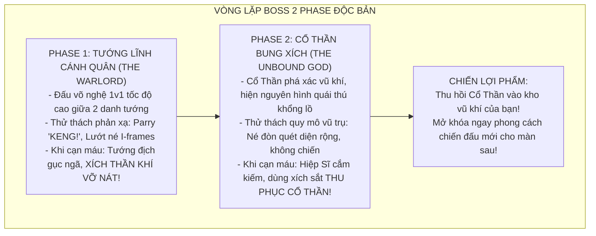

# TÀI LIỆU THIẾT KẾ GAME TOÀN DIỆN (COMPREHENSIVE GAME DESIGN DOCUMENT)
**Tên dự án:** *GODSHACKLE: PHƯỢC THẦN CHI TỎA (The Bound Divinity)*  
**Thể loại:** 2D Fast-paced Dark Fantasy Action Platformer (Chặt chém tốc độ cao, Đối kháng phản xạ)  
**Phong cách hình ảnh:** 2D Side-scrolling Gothic Dark Fantasy (*Darkest Dungeon*, *Berserk*, *Dead Cells*, *Nine Sols*, *Sekiro*)  
**Trọng tâm trải nghiệm (Core Fantasy):** Cảm giác bay nhảy tự do ("phiêu"), chặt chém đanh thép ("đã tay"), né đòn bất tử (I-frames Dash), phản đòn nảy lửa (Parry "KENG!"), và tự do luân chuyển 4 phong cách chiến đấu của Tứ Đại Thần Khí.  
**Cơ chế Boss đặc quyền:** **MỖI BOSS 2 PHASE: Thống Soái Cánh Quân (Đấu võ nghệ 1v1 tốc độ cao) $\rightarrow$ Cổ Thần Bung Xích (Chiến quái thú vũ trụ) $\rightarrow$ Thu phục Cổ Thần vào kho vũ khí của người chơi!**  
**Trùm Cuối Tối Thượng:** **ĐOÀN TRƯỞNG VALERIUS & THẦN THỂ DUNG HỢP (The Ascended Usurper).**

---

## 1. BỐI CẢNH THẾ GIỚI & CỐT TRUYỆN (WORLD LORE)

### 1.1. Cuộc Nội Chiến Tứ Quân & Tứ Đại Thần Khí
- **Tứ Đại Cổ Thần:** Bốn thực thể nguyên thủy trôi nổi ngoài vũ trụ hoặc ngủ sâu trong lòng đất, bị Giáo triều cổ đại xé thịt phong ấn vào 4 bảo khí định quốc: **Kiếm Đơn** (Trật Tự), **Cặp Vuốt Sắt** (Bóng Tối), **Lưỡi Liềm** (Tham Ăn), và **Đại Kiếm** (Cuồng Nộ).
- **Đại Loạn Tứ Quân:** Đế quốc sụp đổ, 4 quân đoàn lớn tranh đoạt thần quyền:
  1. **Quân Đoàn Ánh Sáng Trật Tự** (Phe ta - Do Đoàn trưởng Valerius thống lĩnh).
  2. **Quân Đoàn Ám Ảnh Sát Thủ** (Chiếm giữ pháo đài bóng đêm, dùng Vuốt Bóng Tối ám sát tướng lĩnh).
  3. **Giáo Hội Phàm Thực / Tham Ăn** (Chiếm giữ đầm lầy hầm mộ, dùng Liềm thu hoạch sinh mệnh nuôi cơn đói).
  4. **Quân Thiết Bọc Cuồng Chiến** (Cố thủ trong thành trì đá đen, dùng Đại Kiếm Cuồng Nộ và cơ bắp nghiền nát kẻ thù).
- **Kẻ Được Chọn Của Thần Trật Tự:** Bạn là Đội Trưởng Tiên Phong của Quân Đoàn Trật Tự — người phàm duy nhất được Cổ Thần Trật Tự Aethelgard trong Kiếm Đơn công nhận. Bạn nhận lệnh của Đoàn trưởng Valerius mang kiếm dẹp loạn 3 cánh quân phản nghịch để thống nhất giang sơn.

### 1.2. Bi Kịch Cứu Thế Cực Đoan Của Đoàn Trưởng Valerius
- **Mảnh Di Vật Tiên Tri & Nỗi Sợ Tận Thế:** Valerius từng là vị tướng kiệt xuất, yêu thương anh em như ruột thịt. Hắn nhặt được Mảnh Di Vật Tiên Tri và nhìn thấy trước cảnh **The Oldest God (Đấng Thủy Tổ Cổ Xưa Nhất)** thức tỉnh nghiền nát nhân loại.
- **Sự Cự Tuyệt Của Thần Trật Tự & Vỡ Mộng:** Ban đầu hắn muốn hợp nhất 4 Thần Khí để mượn sức mạnh thần thánh cứu thế. Nhưng khi bị thanh Kiếm Trật Tự từ chối (và chọn bạn), hắn cay đắng nhận ra: *Cổ Thần hoàn toàn vô cảm, không bao giờ cứu loài người!*
- **Quyết Định Hiến Tế Bi Kịch (The Eclipse):** Trước đồng hồ đếm ngược của ngày tận thế, Valerius tự thuyết phục bản thân bằng một logic toán học tàn nhẫn: *"10 vạn anh em đằng nào cũng chết trong miệng Đấng Thủy Tổ. Thà dùng sinh mệnh của họ làm ngọn lửa tế đàn để ta HÓA THÀNH TÂN THẦN, chém chết Đấng Thủy Tổ cứu lấy hàng triệu sinh linh còn lại!"*
- **Sứ Mệnh Ngăn Chặn Của Người Phàm:** Tại Ngai Vàng, bạn rút kiếm đối đầu với kẻ từng là người anh cả kính yêu — khẳng định phẩm giá và ý chí của người phàm không bao giờ thỏa hiệp với sự phản bội đồng đội!

---

## 2. HỆ THỐNG CHIẾN ĐẤU CỐT LÕI (CORE COMBAT SYSTEM)

Tam giác chiến đấu vận hành xoay quanh: **CƠ ĐỘNG TỐC ĐỘ CAO — PHẢN ĐÒN NẢY LỬA — GIẢI PHÓNG KHÁT MÁU**:

```
                  [ NÉ BẤT TỬ / DI CHUYỂN ]
                    (Dash I-frames, Double Jump)
                                ▲
                               ╱ ╲
                              ╱   ╲
                             ▼     ▼
      [ TẤN CÔNG LIÊN HOÀN ] ◄─────► [ PARRY NẢY LỬA ]
      (Combo nạp Khát Máu)          (Bẻ đòn 'KENG!', Hit-stop 0.08s)
             │
             ▼
      [ CAST ĐÒN ĐẶC BIỆT CỔ THẦN [E] ]
      (Tiêu hao Khát Máu, Hủy diệt diện rộng, Rung màn hình)
```

### 2.1. Bộ Kỹ Năng Vận Động (Mobility Toolkit)
1. **Chạy & Đổi Hướng Tức Thì (Instant Pivot):** Tốc độ chạy cao (`SPEED = 280.0`), xoay chuyển hướng không trễ.
2. **Nhảy Đúp (Double Jump - `MAX_JUMP = 2`):** Nhảy bổng linh hoạt, cú nhảy thứ 2 tạo vệt gió mờ giúp vượt bẫy và không chiến với các đòn quét sàn.
3. **Lướt Bất Tử (I-Frames Dash):** 
   - Tốc độ lướt cao (`DASH_SPEED = 650.0`), thời lượng `0.2s`.
   - Trong suốt thời gian lướt, nhân vật hoàn toàn miễn nhiễm sát thương và có thể lướt xuyên thân quái.
   - **Attack-Cancel:** Hủy động tác chém thường sang Dash bất kỳ lúc nào để phản xạ sinh tử.

### 2.2. Cơ Chế Phản Đòn Nảy Lửa (The Parry System)
- **Kích hoạt:** Bấm nút Parry (Chuột Phải / Phím chỉ định), nhân vật giơ vũ khí thủ thế trong khung thời gian `0.18 giây`.
- **Khi đỡ trúng đòn tấn công của địch:**
  - **Miễn nhiễm 100% sát thương**.
  - **Hit-stop (Khựng hình 0.08s):** Dừng khung hình tạo cảm giác va chạm sắt thép đanh thép.
  - **Âm thanh & Hiệu ứng:** Tiếng **"KENGGG!"** giòn tan, tia lửa cam vàng tóe sáng.
  - **Bẻ đòn (Poise Broken):** Kẻ địch văng lùi, rơi vào trạng thái choáng váng sơ hở (Stagger).
  - **Thưởng nóng:** Người chơi được nạp ngay `+35% Khát Máu` và có thể bấm Tấn công ngay lập tức để tung đòn **Phản Kích Sấm Sét (Riposte)** lướt chém xuyên qua quái.

### 2.3. Cơ Chế "Độ Khát Máu" (Bloodlust Gauge: 0 $\rightarrow$ 100%)
- Chém thường trúng đích: `+15%` mỗi nhát.
- Lướt chém (Dash Attack): `+25%`.
- Phản đòn (Parry Riposte): `+35%`.
- Khi đầy 100%: Vũ khí rực sáng thần uy $\rightarrow$ Bấm **[E]** kích hoạt tuyệt kỹ tối thượng của Cổ Thần đang cầm.

---

## 3. HỆ THỐNG TỨ ĐẠI THẦN KHÍ (MULTI-WEAPON ARSENAL)

Mỗi Cổ Thần là một món vũ khí riêng biệt với cơ chế gameplay độc nhất:

| Thần Khí | Cổ Thần Ngự Trị | Đặc trưng lối chơi | Cơ chế độc quyền (Passive & Normal Attack) | Đòn Đặc Biệt [E] (Khi đầy Khát Máu) |
| :--- | :--- | :--- | :--- | :--- |
| 🗡️ **Kiếm Đơn** *(Khởi đầu)* | **Aethelgard** *(Trật Tự)* | Điềm tĩnh, sải đòn chuẩn mực, nhịp điệu hoàn hảo, thưởng cực lớn cho phản xạ. | **Parry Master ("KENG!"):** Khung đỡ đòn chuẩn xác, bẻ gãy đòn quái và hồi máu nhẹ khi Riposte. Bạn là người duy nhất được thần công nhận. | **Nhất Kiếm Tịch Diệt:** Ngưng đọng thời gian 0.5s, chém rạch đôi không gian trước mặt. |
| 🩸 **Cặp Vuốt Sắt** *(Đoạt tại Ải 1)* | **Umbrath** *(Bóng Tối)* | Tốc độ chém xé bão táp, sát thủ áp sát, dồn ép mục tiêu, biến ảo. | **Hắc Huyết Xâm Thực (Withering Black Health):** Đòn cào chuyển hóa máu địch sang **Màu Đen** theo từng đoạn. Khi kích nổ (đòn kết thúc combo hoặc đòn [E]), địch lập tức mất toàn bộ lượng máu đen đó! | **Hắc Ảnh Loạn Vũ (Shadow Dance):** Biến thành bóng đen lướt chém ziczac 6 nhát liên tiếp toàn màn hình (hoàn toàn bất tử trong lúc chém), nhát cuối chém xuyên tâm kích nổ toàn bộ lượng máu đen! |
| ⛓️ **Lưỡi Liềm** *(Đoạt tại Ải 2)* | **Vorax** *(Tham Ăn / Phàm Thực)* | Quét 360 độ diện rộng, không chiến (Air Combat), khống chế và kéo cự ly quái. | **Reaper Feast:** Quét liềm kéo giật bầy quái về gần mình để "ăn thịt". Tốc độ nạp Khát Máu nhanh gấp đôi các vũ khí khác. | **Bạo Thực Yến Tiệc (Devouring Vortex):** Tạo miệng xoáy hư không háu đói hút toàn bộ quái xung quanh vào tâm, nghiền nát và nuốt trọn sinh lực (hồi máu cho người chơi). |
| 🛡️ **Đại Kiếm** *(Đoạt tại Ải 3)* | **Vargon** *(Cuồng Nộ & Sức Nặng)* | Nặng nề, uy lực chấn động, siêu giáp (Hyper-armor), đập vỡ khiên giáp, sức mạnh cơ bắp. | **Hyper-Armor Slash:** Đòn chém không thể bị ngắt bởi đòn đánh thường của quái, đập vỡ thế thủ (Guard Break) của kẻ mang khiên. | **Cuồng Thần Thức Tỉnh (Berserk Fury):** Nhân vật gầm thét phát điên, mắt đỏ rực. Trong 8 giây: Miễn nhiễm hoàn toàn choáng/ngắt chiêu, tăng 60% sát thương, mỗi nhát chém phóng ra sóng xung kích! |

---

## 4. CHI TIẾT CƠ CHẾ "HẮC HUYẾT XÂM THỰC" (WITHERING BLACK HEALTH)

```
[================ Thanh Máu Của Kẻ Địch / Boss ================]
[   Máu Đỏ Hiện Tại   |   MÁU ĐEN BỊ XÂM THỰC   |   Đã Mất   ]
                      ▲                         ▲
                   Điểm cắt                   Điểm nổ
```

1. **Chuyển hóa Máu Đen:**
   - Khi đánh bằng Cặp Vuốt, mỗi nhát cào gây 20% sát thương trực tiếp, nhưng **chuyển hóa 80% sát thương còn lại thành Máu Đen** trên thanh máu của kẻ địch.
   - Vùng máu đen thể hiện lượng sát thương tiềm tàng tích lũy bên trong mục tiêu.
2. **Kích Nổ (Detonation):**
   - Đòn đánh thứ 4 của chuỗi combo thường hoặc đòn Dash-Attack sẽ kích nổ đoạn máu đen hiện có.
   - Khi kích hoạt kỹ năng **[E] Hắc Ảnh Loạn Vũ**: 5 nhát chém ziczac đầu bồi thêm một lượng lớn máu đen, và nhát thứ 6 giáng xuống sẽ **kích nổ 100% lượng máu đen**, thổi bay lập tức thanh máu của địch kèm hiệu ứng vỡ vụn hắc ám!
3. **Cơ chế Hoàn nguyên (Decay Window):**
   - Nếu người chơi không tấn công hoặc bị ngắt nhịp quá 3.5 giây, lượng máu đen sẽ rỉ hồi phục dần về máu đỏ bình thường với tốc độ 15%/giây.

---

## 5. HỆ THỐNG BOSS 2 PHASE & VÒNG LẶP CHIẾN DỊCH



### Chi tiết Dàn Boss 4 Chương:

1. **Ải 1: Pháo Đài Ngầm Của Quân Sát Thủ (The Umbral Catacombs)**
   - **Phase 1 — Sát Thủ Vô Ảnh Corina:** Tốc độ âm thanh, tàng hình biến ảo, lướt chém ziczac sau lưng người chơi.
   - **Phase 2 — Umbrath Bung Xích (Cổ Thần Bóng Tối):** Đấu trường chìm vào bóng đêm tuyệt đối, Umbrath hiện thân thành thực thể bóng tối nghìn mắt phóng phi đao hắc ám từ hư không.
   - **Phần thưởng:** Thu phục **Cặp Vuốt Sắt Umbrath** (mở khóa Hắc Huyết Xâm Thực & Hắc Ảnh Loạn Vũ chém 6 nhát bất tử).

2. **Ải 2: Đầm Lầy Tu Viện Phàm Thực (The Mire of Devouring Bones)**
   - **Phase 1 — Nữ Trưởng Tu Morwenna:** Múa liềm xích 360 độ, tạo đầm lầy hút chân và triệu hồi bầy quái háu đói.
   - **Phase 2 — Vorax Bung Xích (Cổ Thần Tham Ăn):** Hóa thành quái thú hàm ngoạm khổng lồ háu đói nuốt trọn không gian, tạo các hố đen hút sinh lực.
   - **Phần thưởng:** Thu phục **Lưỡi Liềm Vorax** (mở khóa Reaper Feast & Bạo Thực Yến Tiệc).

3. **Ải 3: Thành Trì Thiết Bọc Cuồng Chiến (The Iron Berserk Bastion)**
   - **Phase 1 — Thống Chế Thiết Hạm Roderick:** Mang đại trọng giáp và đại khiên, vung đại kiếm bổ nứt sàn đá, đòi hỏi lướt né ra sau gáy phá thế.
   - **Phase 2 — Vargon Bung Xích (Cổ Thần Cuồng Nộ):** Khổng lồ nham thạch cuồng nộ gầm thét, dậm chân tạo sóng xung kích và mưa đá rơi tự do.
   - **Phần thưởng:** Thu phục **Đại Kiếm Vargon** (mở khóa Hyper-Armor & Cuồng Thần Thức Tỉnh [E] phát điên tăng DMG).

4. **Ải 4: Kinh Đô Hoàng Kim & Ngai Vàng Phản Bội — FINAL CLIMAX**
   - **Sự kiện The Eclipse:** Đoàn trưởng Valerius kích hoạt cấm trận hiến tế toàn quân đoàn để Hóa Thần.
   - **Phase 1 — Valerius Kẻ Cướp Ngai:** Đấu kiếm hoàng kim tốc độ âm thanh, Valerius có khả năng parry ngược lại đòn đánh của người chơi.
   - **Phase 2 — Quái Thai Thần Vị (The Ascended Abomination):** Valerius bị quyền năng của 4 Cổ Thần làm biến dạng thành một thực thể quái thai thần quyền vũ trụ khổng lồ. Người chơi phải luân chuyển cả 4 vũ khí để ngăn chặn và hủy diệt hắn!

---

## 6. THIẾT KẾ KỸ THUẬT & KIẾN TRÚC MÃ NGUỒN (TECHNICAL ARCHITECTURE)

Dự án tuân thủ mô hình **Component-based** hướng đối tượng sạch sẽ của Godot 4:

1. **Bộ Điều Khiển Người Chơi ([`scripts/player.gd`](file:///d:/Project/sin-eater/scripts/player.gd)):**
   - Chịu trách nhiệm vật lý di chuyển (`velocity`), Nhảy đúp (`jump`), Lướt né (`dash` có I-frames), và lắng nghe nút Parry.
   - Giữ tham chiếu linh hoạt tới vũ khí hiện tại:
     ```gdscript
     @onready var current_weapon: BaseWeapon = $Visual/CurrentWeapon
     ```
2. **Lớp Cơ Sở Vũ Khí ([`scripts/weapons/base_weapon.gd`](file:///d:/Project/sin-eater/scripts/weapons/base_weapon.gd)):**
   - Định nghĩa Interface chung cho 4 món vũ khí:
     ```gdscript
     func attack() -> void
     func dash_attack() -> void
     func parry() -> void
     func cast_special() -> void
     ```
   - Chứa biến `bloodlust: float` (0 đến 100) và phát tín hiệu cập nhật giao diện HUD.
3. **Cơ Chế Hắc Huyết Máu Đen Trên Kẻ Địch ([`scripts/dummy.gd`](file:///d:/Project/sin-eater/scripts/dummy.gd)):**
   - Kẻ địch quản lý: `current_health: float`, `black_health: float`, và `decay_timer: float`.
   - Khi nhận đòn từ Cặp Vuốt: chuyển sát thương thành `black_health`.
   - Khi nhận đòn kích nổ (Detonate): trừ thẳng `current_health -= black_health; black_health = 0`.
4. **Hệ Thống Phản Hồi Giác Quan (Game Juice):**
   - **Hit-stop (Micro-freeze):** Ngưng đọng thời gian 0.05s khi chém thường và 0.08s khi Parry / Đòn đặc biệt.
   - **Screen Shake:** Rung nhẹ ở nhát chém thứ 3 và rung mạnh ở đòn [E] Đòn Đặc Biệt.
