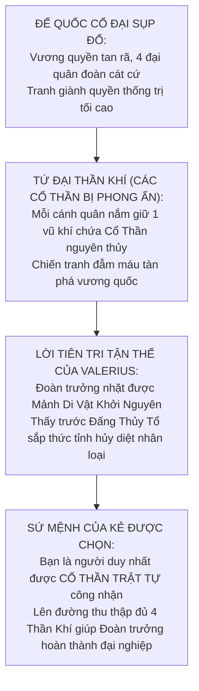
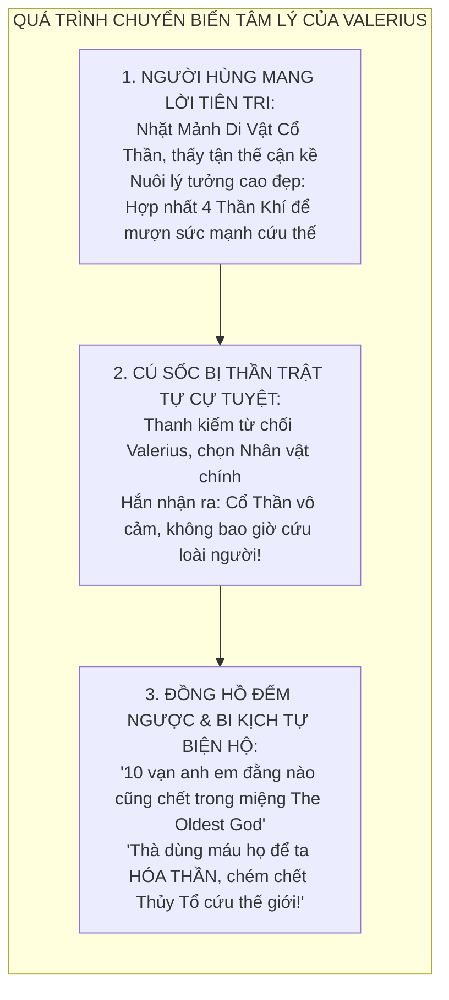
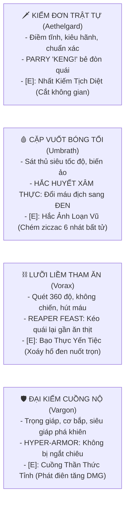

# 🩸 KỊCH BẢN & CỐT TRUYỆN TOÀN TẬP: GODSHACKLE (PHƯỢC THẦN CHI TỎA)
### *(The Caged Gods: 4 Warring Factions, The Prophecy & The Tragic Ascension)*

**Tác phẩm:** *GODSHACKLE: PHƯỢC THẦN CHI TỎA (The Bound Divinity)*  
**Thể loại:** Dark Fantasy Grimdark, Cosmic Horror, Fast-paced Action Platformer  
**Âm hưởng chủ đạo:** *Berserk* (Chiến tranh tàn bạo, tình huynh đệ bi kịch, đại lễ hiến tế The Eclipse), *Bloodborne* & *Lovecraft* (Cổ Thần vô cảm, sự biến dạng của kẻ muốn cứu thế bằng cấm thuật), *Sekiro / Nine Sols* (Kiếm thuật chuẩn xác, tiếng Parry 'KENG!' đanh thép).  
**Cơ chế Boss đặc quyền:** **MỖI BOSS 2 PHASE: Thống Soái Cánh Quân (Đấu võ nghệ 1v1 tốc độ cao) $\rightarrow$ Cổ Thần Bung Xích (Chiến quái thú vũ trụ) $\rightarrow$ Thu phục Cổ Thần vào kho vũ khí của bạn!**  
**Trùm Cuối Tối Thượng:** **ĐOÀN TRƯỞNG VALERIUS & THẦN THỂ DUNG HỢP (The Ascended Usurper) $\rightarrow$ SECRET FINAL BOSS: ĐẤNG THỦY TỔ KHỞI NGUYÊN (The Oldest God).**

---

## 🏛️ PHẦN 1: BỐI CẢNH THẾ GIỚI — CUỘC NỘI CHIẾN TỨ QUÂN TRANH ĐOẠT THẦN QUYỀN

### 1.1. Bản Chất Các Cổ Thần (The Primordial Entities)
* Các Cổ Thần là những thực thể nguyên thủy trôi nổi ngoài vũ trụ hoặc ngủ sâu trong lòng đất từ thuở hồng hoang. Chúng hoàn toàn vô cảm trước sự sống chết của loài người; hơi thở và tà khí của chúng bóp méo quy luật vật lý.
* Thời cổ đại, Giáo Triều Sắt đã phong ấn linh hồn và uy lực của 4 Cổ Thần mạnh nhất vào **4 món vũ khí định quốc bằng sắt thiên thạch và xích nguyền**:
  1. **Kiếm Đơn:** Giam cầm Cổ Thần Trật Tự (Aethelgard).
  2. **Cặp Vuốt Sắt:** Giam cầm Cổ Thần Bóng Tối (Umbrath).
  3. **Lưỡi Liềm:** Giam cầm Cổ Thần Tham Ăn / Phàm Thực (Vorax).
  4. **Đại Kiếm:** Giam cầm Cổ Thần Cuồng Nộ & Sức Nặng (Vargon).

### 1.2. Cuộc Chiến Tứ Quân (The War of Four Banners)
* Khi đế quốc sụp đổ, 4 đại tướng lĩnh chia cắt đất nước thành 4 cánh quân đẫm máu:
  1. **Quân Đoàn Ánh Sáng Trật Tự (The Vanguard of Order):** Do Đoàn trưởng Valerius thống lĩnh, mang ngọn cờ tái lập hòa bình và luật pháp.
  2. **Quân Đoàn Ám Ảnh Sát Thủ (The Shadow Brotherhood):** Ẩn mình trong pháo đài ngầm phía Bắc, dùng Vuốt Bóng Tối găm cắm sự xâm thực hắc ám để đoạt mệnh tướng lĩnh.
  3. **Giáo Hội Phàm Thực / Tham Ăn (The Gluttonous Coven):** Thống trị vùng đầm lầy và hầm mộ phía Đông, dùng Lưỡi Liềm thu hoạch sinh mệnh để nuôi cơn đói vô tận.
  4. **Quân Thiết Bọc Cuồng Chiến (The Iron Berserkers):** Cố thủ trong thành trì đá đen phía Tây, dùng Đại Kiếm Cuồng Nộ tôn sùng sức mạnh cơ bắp và sự bất tử cuồng nộ.

---

## 🗡️ PHẦN 2: CHÂN TƯỚNG NHÂN VẬT & BI KỊCH CHUYỂN HÓA CỦA VALERIUS

### 2.1. Nhân Vật Chính — Người Dẫn Đường Duy Nhất Của Thần Trật Tự
* **Xuất thân:** Bạn là Đội Trưởng Tiên Phong của Quân Đoàn Ánh Sáng Trật Tự — người lính trung kiên nhất dưới trướng Valerius, người từng được Valerius che chở và kéo ra khỏi hố chôn xác năm xưa.
* **Mối liên kết định mệnh:**
  - Khi thanh Kiếm Đơn được khai quật, chính Valerius đã hào hứng chạm vào, nhưng bị thanh kiếm từ chối phũ phàng, phóng tia sét trật tự làm cháy rát cánh tay hắn.
  - Ngược lại, khi bạn chạm vào, thanh kiếm lập tức ngân vang tiếng chuông đồng thuần khiết. **Aethelgard — Cổ Thần Trật Tự** đã chọn bạn làm người duy nhất đủ sự điềm tĩnh và kỷ luật để giao tiếp.
* **Lý tưởng:** Bạn trung thành tuyệt đối với Valerius. Bạn chấp nhận cầm thanh gươm của Thần Trật Tự bước vào lửa đạn viễn chinh, quyết tâm thu thập đủ 3 Thần Khí còn lại để mang về giúp Đoàn trưởng hoàn thành đại nghiệp cứu thế.

### 2.2. Đoàn Trưởng Valerius — Bi Kịch Của Đấng Cứu Thế Cực Đoan
* **Khởi đầu vĩ đại & Mảnh Di Vật Tiên Tri:**
  - Valerius là một thiên tài quân sự kiệt xuất, phong nhã, được hàng triệu người dân và binh lính ca tụng là "Ngôi sao hy vọng duy nhất sẽ thống nhất vương quốc".
  - Trong một lần khảo cổ tàn tích sơ khai, Valerius đã nhặt được **Mảnh Di Vật Tiên Tri (The Prophetic Shard)**. Mảnh di vật mở ra trong tâm trí hắn một viễn cảnh tương lai kinh hoàng: **THE OLDEST GOD (Đấng Thủy Tổ Cổ Xưa Nhất)** dưới lòng đất sắp cựa mình thức tỉnh. Khi thời khắc đến, toàn bộ lục địa sẽ bị nghiền nát thành tro bụi.
  - Ban đầu, Valerius mang lý tưởng vô cùng thuần khiết: *Hắn muốn dẹp yên nội chiến, quy tụ đủ 4 Thần Khí để "mượn sức mạnh" của 4 Cổ Thần, hiệp lực cùng nhân loại đẩy lùi Đấng Thủy Tổ.*

* **Cú sốc sụp đổ lý tưởng — Sự cự tuyệt của Thần Trật Tự:**
  - Khoảnh khắc thanh Kiếm Đơn từ chối Valerius và chọn bạn, toàn bộ đức tin của hắn vỡ vụn.
  - Thần Trật Tự Aethelgard không chỉ cự tuyệt hắn, mà còn phóng ra luồng suy nghĩ khinh miệt lạnh buốt vào đầu Valerius: *"Loài người các ngươi sống hay chết thì liên quan gì đến ta? Ngày tận thế của The Oldest God chỉ là chu kỳ tự nhiên của vũ trụ."*
  - **Sự thật bàng hoàng:** Valerius cay đắng nhận ra Cổ Thần hoàn toàn vô cảm. Chúng không bao giờ có ý định cứu vớt loài người! Cầu xin hay "mượn sức mạnh" của chúng là điều ngây thơ tự sát. Kẻ phàm trần cầm Thần Khí muôn đời chỉ là con rối bị chúng giật dây.

* **Bước chuyển biến tâm lý (Đồng hồ đếm ngược & Sự tự biện hộ cực đoan):**
  - Mảnh di vật tiên tri liên tục rung lên cảnh báo: Những trận động đất ngầm ngày càng dữ dội, thời gian trước ngày tận thế đang cạn kiệt từng giờ.
  - Rơi vào chân tường của sự tuyệt vọng, Valerius đi đến một logic toán học tàn nhẫn để tự thuyết phục bản thân:
    > *"Khi Đấng Thủy Tổ thức tỉnh, mười vạn người anh em này, cùng toàn bộ dân chúng, ĐẰNG NÀO CŨNG SẼ CHẾT trong đau đớn."*  
    > *"Nếu để họ chết vô nghĩa trong ngày tận thế, đó là sự thất bại của ta. NHƯNG nếu ta dùng sinh mệnh của họ làm ngọn lửa tế đàn, cưỡng ép 4 Cổ Thần hợp nhất vào ta để ta HÓA THÀNH TÂN THẦN... Ta sẽ có đủ thần lực vô biên để chém chết Đấng Thủy Tổ!"*  
    > *"Mười vạn người anh em sẽ chết, nhưng họ sẽ bất tử trong cơ thể ta, cùng ta cứu lấy hàng triệu sinh linh còn lại của cõi trần!"*
  - Hắn chấp nhận tự bôi đen linh hồn mình, chấp nhận trở thành kẻ phản bội tội đồ thiên thu bị ngàn đời nguyền rủa, miễn là nhân loại có cơ hội sống sót!

* **Mối quan hệ với Nhân vật chính:**
  - Hắn không ghét bạn, hắn THỰC LÒNG YÊU THƯƠNG và coi bạn là người anh em quan trọng nhất. Vì thanh kiếm chọn bạn, chỉ có bạn mới đủ bản lĩnh đi dẹp loạn 3 phe phái và mang 3 Thần Khí về.
  - Hắn gửi gắm bạn đi viễn chinh trong nỗi dằn vặt khôn nguôi, chờ đợi ngày bạn mang đủ vũ khí về kinh thành để thực hiện nghi lễ hiến tế đau đớn nhất lịch sử.

---

## 🔱 PHẦN 3: BỘ TỨ THẦN KHÍ — 4 PHONG CÁCH CHIẾN ĐẤU ĐỘC BẢN

| Thần Khí | Cổ Thần Ngự Trị | Tính cách Cổ Thần | Cơ chế Gameplay độc quyền | Đòn Đặc Biệt [E] (100% Khát Máu) |
| :--- | :--- | :--- | :--- | :--- |
| 🗡️ **Kiếm Đơn** *(Khởi đầu)* | **Aethelgard** *(Trật Tự)* | Điềm tĩnh, kiêu ngạo, căm ghét chém loạn xạ. Chỉ phát sáng khi người chơi đỡ đòn chính xác. | **Parry Master ("KENG!"):** Khung đỡ đòn chuẩn xác 0.18s, bẻ gãy đòn quái, hồi máu nhẹ khi Riposte. | **Nhất Kiếm Tịch Diệt:** Ngưng đọng thời gian 0.5s, chém rạch đôi không gian trước mặt. |
| 🩸 **Cặp Vuốt Sắt** *(Ải 1)* | **Umbrath** *(Bóng Tối)* | Xảo quyệt, rình rập, thì thầm rủ rê biến kẻ thù thành bóng đêm. | **Hắc Huyết Xâm Thực:** Đòn cào chuyển hóa máu địch sang **Màu Đen** theo từng đoạn. Khi kết thúc combo hoặc lướt chém, kích nổ trừ sạch đoạn máu đen đó! | **Hắc Ảnh Loạn Vũ:** Biến thành bóng đen lướt chém ziczac 6 nhát toàn màn hình (bất tử 100%), nhát thứ 6 kích nổ toàn bộ lượng máu đen! |
| ⛓️ **Lưỡi Liềm** *(Ải 2)* | **Vorax** *(Tham Ăn / Phàm Thực)* | Đói khát vô tận, thèm khát nuốt trọn sinh mệnh đối thủ. | **Reaper Feast:** Quét liềm kéo giật bầy quái về gần mình để "ăn thịt". Tốc độ nạp Khát Máu nhanh gấp đôi. | **Bạo Thực Yến Tiệc:** Tạo hố đen háu đói hút toàn bộ kẻ địch xung quanh vào tâm nghiền nát, hồi máu dồi dào cho người chơi. |
| 🛡️ **Đại Kiếm** *(Ải 3)* | **Vargon** *(Cuồng Nộ & Sức Nặng)* | Điên dại, gầm thét, tôn sùng sức mạnh cơ bắp tuyệt đối. | **Hyper-Armor:** Đòn chém không thể bị ngắt bởi quái thường, đập vỡ thế thủ (Guard Break) của kẻ mang khiên. | **Cuồng Thần Thức Tỉnh:** Gầm thét phát điên, mắt đỏ rực. Trong 8 giây: Miễn nhiễm choáng/ngắt chiêu, tăng 60% sát thương, mỗi nhát chém tạo sóng xung kích! |

---

## 🗺️ PHẦN 4: HÀNH TRÌNH 4 ẢI & HỆ THỐNG BOSS 2 PHASE

```mermaid
flowchart TD
    subgraph STAGE1["ẢI 1: PHÁO ĐÀI NGẦM CỦA QUÂN SÁT THỦ"]
        A1["Phase 1: Sát Thủ Vô Ảnh Corina (Vuốt bóng tối ziczac)"] -->|Vỡ xích| B1["Phase 2: Umbrath - Cổ Thần Bóng Tối Bung Xích"]
        B1 -->|Thu phục| R1["Thu hồi Cặp Vuốt Sắt Umbrath\n(Chứa Thánh Tích Khởi Nguyên 1: Hắc Dạ Thần Ấn)"]
    end

    subgraph STAGE2["ẢI 2: ĐẦM LẦY & TU VIỆN PHÀM THỰC"]
        A2["Phase 1: Nữ Trưởng Tu Morwenna (Liềm chuông tang)"] -->|Vỡ xích| B2["Phase 2: Vorax - Cổ Thần Tham Ăn Bung Xích"]
        B2 -->|Thu phục| R2["Thu hồi Lưỡi Liềm Vorax\n(Chứa Thánh Tích Khởi Nguyên 2: Bạo Thực Cốt Tráp)"]
    end

    subgraph STAGE3["ẢI 3: THÀNH TRÌ THIẾT BỌC CUỒNG CHIẾN"]
        A3["Phase 1: Thống Chế Thiết Hạm Roderick (Trọng kiếm khiên sắt)"] -->|Vỡ xích| B3["Phase 2: Vargon - Cổ Thần Cuồng Nộ Nham Thạch"]
        B3 -->|Thu phục| R3["Thu hồi Đại Kiếm Vargon\n(Chứa Thánh Tích Khởi Nguyên 3: Cuồng Nộ Huyết Tinh)"]
    end

    subgraph STAGE4["ẢI 4: KINH ĐÔ HOÀNG KIM & ĐẠI LỄ HIẾN TẾ NGAI VÀNG"]
        A4["Phase 1: Valerius Đấng Cứu Thế Bi Kịch (Đấu kiếm hoàng kim)"] -->|Valerius kích hoạt hiến tế| B4["Phase 2: VALERIUS THẦN THỂ DUNG HỢP (The Ascended Usurper)"]
        B4 -->|Nếu đủ 3 Thánh Tích| B5["PHASE 3 / SECRET BOSS: ĐẤNG THỦY TỔ KHỞI NGUYÊN (The Oldest God)"]
    end
```

---

### 👑 ẢI 4: KINH ĐÔ HOÀNG KIM & ĐẠI LỄ HIẾN TẾ NGAI VÀNG (THE SUN THRONE ECLIPSE)
* **Bối cảnh:** Kinh đô huy hoàng sau khi bạn dẹp yên 3 cánh quân. Cờ xí của Quân Đoàn Ánh Sáng Trật Tự bay rợp trời. Toàn bộ quân lính reo hò đón mừng bạn và Đoàn trưởng Valerius bước vào Thánh Điện Hoàng Kim.
* **Khoảnh khắc bi kịch nổ tung (The Eclipse Event):**
  - Bạn quỳ gối dâng 3 Thần Khí thu được lên trước ngai vàng.
  - Valerius bước tới, đôi mắt đỏ hoe, run rẩy đặt tay lên vai bạn. Không có nụ cười của kẻ phản bội độc ác, chỉ có ánh mắt đẫm lệ của một người anh trai sắp gánh chịu bản án địa ngục:
    > *"Ngươi đã làm rất tốt, người anh em của ta... Tốt hơn bất kỳ ai trên cõi đời này... Giờ thì, hãy tha thứ cho ta. Ta phải gánh lấy ngọn lửa này... để nhân loại có được ngày mai!"*
  - Hắn cắm thanh kiếm tế lễ xuống tâm chấn điện thờ: **Đại tế đàn kích hoạt!**
  - Các cánh cổng đóng sập. Xích sắt và ngọn lửa máu phun lên từ sàn nhà, thiêu rụi và hút cạn sinh mệnh của mười vạn binh lính đang reo hò bên ngoài. Tiếng khải hoàn biến thành tiếng thét gào tuyệt vọng.
  - Valerius đau đớn gào thét khi cưỡng ép năng lượng của 10 vạn anh em cùng 4 Cổ Thần nhồi nhét vào thân xác phàm trần của mình để thăng hoa thành Tân Thần!
* **Trận Tử Chiến Giữa Hai Lý Tưởng:**
  - **Phase 1 — Valerius Đấng Cứu Thế Cực Đoan:** Đấu kiếm hoàng kim tốc độ ánh sáng. Valerius vừa chém vừa khóc, liên tục gào thét giải thích nỗi sợ hãi về Đấng Thủy Tổ: *"Ngươi không hiểu! Đấng Thủy Tổ sắp cựa mình rồi! Mười vạn người này đằng nào cũng chết! Ta đang cứu lấy thế giới này!"*
  - **Phase 2 — Valerius Thần Thể Dung Hợp (The Ascended Usurper):** Bị bạn đánh trọng thương, cơ thể Valerius không chịu nổi sức mạnh của 4 Cổ Thần, biến dạng thành quái thai thần quyền khổng lồ. Bạn vận dụng trọn vẹn 4 Thần Khí để chém tan ảo tưởng thần thánh của hắn.

---

## ⚖️ PHẦN 5: CÁC NHÁNH KẾT CỤC & 3 THÁNH TÍCH KHỞI NGUYÊN
*(Ghi chú: Nội dung chi tiết các nhánh kết thúc đang được lưu lại để người dùng tiếp tục tinh chỉnh sau)*

### 5.1. Cơ Chế 3 Thánh Tích Khởi Nguyên (The Primordial Relics)
* Ở Ải 1, 2, 3 có 3 khu vực bí mật cất giấu 3 Thánh Tích Khởi Nguyên (nơi neo giữ bản nguyên sinh mệnh của 3 Cổ Thần khi bị Giáo Triều phong ấn lần đầu).
* Tùy thuộc vào số lượng Thánh Tích người chơi thu thập được khi đến Ngai Vàng, số phận của Quân Đoàn và Nhân vật chính sẽ rẽ sang các hướng khác nhau:
  - **Nhánh Thiếu Thánh Tích (0-2 Thánh Tích):** Bạn hạ gục Valerius nhưng không đủ sức bóc tách kẻ giật dây tối cao. Năng lượng tế đàn biến loạn dẫn đến bi kịch mất mát hoặc siêu thoát linh hồn cho đồng đội.
  - **Nhánh Thu Thập Đủ 3 Thánh Tích:** 3 Thánh Tích cộng hưởng cùng Kiếm Trật Tự lôi kẻ giật dây thực sự ra ánh sáng — **ĐẤNG THỦY TỔ KHỞI NGUYÊN (The Oldest God)** — mở khóa **Secret Final Boss**! Đánh bại hắn, bạn đoạt lại quyền năng tối sơ để **bẻ gãy cấm thuật, hồi sinh trọn vẹn mười vạn anh em quân đoàn**!
