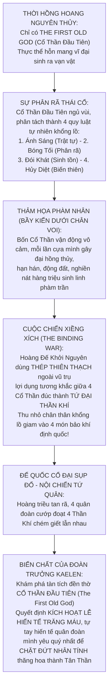
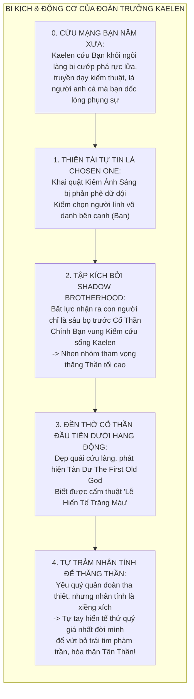
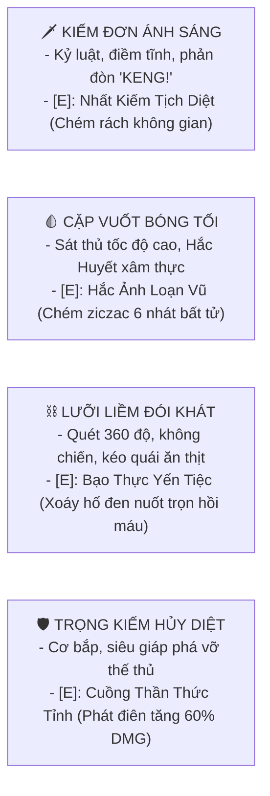
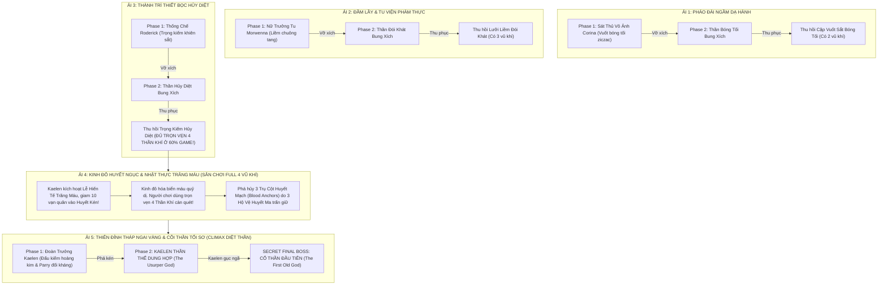

# 🩸 KỊCH BẢN & CỐT TRUYỆN TOÀN TẬP: ASHEN DAWN (HÔI TẪN LÊ MINH)
### *(Rạng Đông Tro Tàn: Cuộc Đại Phong Ấn Thái Cổ, Tình Huynh Đệ Bi Kịch & Sự Trỗi Dậy Của Cổ Thần)*

**Tác phẩm:** *ASHEN DAWN: HÔI TẪN LÊ MINH (The Ashen Eclipse)*  
**Thể loại:** Dark Fantasy Grimdark, Fast-paced Action Platformer  
**Trọng tâm trải nghiệm:** Kiếm thuật chuẩn xác, phản đòn nảy lửa (Parry "KENG!"), né đòn lướt bóng (I-frames Dash), cơ động tốc độ cao, và luân chuyển 4 phong cách chiến đấu của Tứ Đại Thần Khí.  
**Cơ chế Boss đặc quyền:** **MỖI BOSS 2 PHASE: Thống Soái Cánh Quân (Đấu võ nghệ 1v1 tốc độ cao) $\rightarrow$ Cổ Thần Bung Xích (Chiến quái thú khổng lồ) $\rightarrow$ Thu phục Cổ Thần vào kho vũ khí của bạn!**  
**Trùm Cuối Tối Thượng:** **ĐOÀN TRƯỞNG KAELEN (Kẻ Cướp Thần Quyền) $\rightarrow$ SECRET FINAL BOSS: CỔ THẦN ĐẦU TIÊN (The First Old God).**

---

## 🏛️ PHẦN 1: BỐI CẢNH THẾ GIỚI — THẦN THOẠI THÁI CỔ & NỘI CHIẾN TỨ QUÂN

### 1.0. Thần Phả Thái Cổ & Cuộc Chiến Xiềng Xích (The Binding War)
* **Nguồn gốc Tứ Đại Cổ Thần:**
  - Thuở sơ khai, vũ trụ chỉ tồn tại một thực thể tối sơ duy nhất: **The First Old God (Cổ Thần Đầu Tiên)** — khối hỗn mang vô thủy vô chung.
  - Khi cõi trần thành hình, Cổ Thần Đầu Tiên chìm vào giấc ngủ vĩnh hằng và tự phân rã thành **Bốn Trụ Cột Quy Luật Tự Nhiên**:
    1. **Cổ Thần Ánh Sáng:** Hiện thân của quy chuẩn, trật tự, lề lối và sự phán xét thanh tẩy lạnh lùng.
    2. **Cổ Thần Bóng Tối:** Hiện thân của sự ẩn mật, bào mòn, phân hủy sinh mệnh và sự hoại diệt của hư vô.
    3. **Cổ Thần Đói Khát:** Bản năng sinh tồn sơ khai nhất — cỏ cây hút dưỡng chất, dã thú ăn thịt, sự nuốt chửng vô tận để kéo dài sinh mệnh.
    4. **Cổ Thần Hủy Diệt:** Sức mạnh cơ học và biến thiên địa chất — động đất, núi lửa sụp đổ, sự phá hủy dữ dội để tái sinh chu kỳ đất trời mới.
  - *Bản chất của Cổ Thần:* Chúng không mang đạo đức thiện hay ác, mà là **những lực lượng tự nhiên khổng lồ và vô cảm tuyệt đối**. Mỗi bước di chuyển hay hơi thở của chúng đều gây ra đại hồng thủy, hạn hán và dịch bệnh, giẫm nát các nền văn minh phàm trần như loài người giẫm lên bầy kiến.
* **Cuộc Chiến Xiềng Xích (The Binding War) — Loài người nghịch thiên:**
  - Đứng trước nguy cơ diệt vong, vị Hoàng Đế Khởi Nguyên của loài người cùng các thuật sĩ cổ đại đã tìm thấy **Thép Thiên Thạch** — loại khoáng thạch vũ trụ duy nhất không chịu sự chi phối của các quy luật đại địa.
  - Trải qua cuộc viễn chinh đẫm máu ngàn năm, con người đã lợi dụng quy luật tương khắc tự nhiên giữa 4 Cổ Thần (Ánh Sáng khắc chế Bóng Tối, Đói Khát kiềm tỏa Hủy Diệt) kết hợp cùng sắt thiên thạch để **rút cạn chân thân khổng lồ của Tứ Đại Cổ Thần, giam cầm chúng vào 4 món Thần Khí Định Quốc**.
  - Bốn bảo khí này trở thành trụ cột thái bình, giúp đế quốc hưng thịnh suốt hàng thiên niên kỷ.

### 1.1. Bản Chất Tứ Đại Cổ Thần Ngự Trong Thần Khí
1. **Kiếm Đơn:** Giam cầm **Cổ Thần Ánh Sáng**. Đòi hỏi sự kỷ luật, điềm tĩnh tuyệt đối, chỉ ban phát uy lực khi người dùng đỡ đòn chuẩn xác.
2. **Cặp Vuốt Sắt:** Giam cầm **Cổ Thần Bóng Tối**. Mang bản tính cào xé hung hiểm, biến đổi máu đối thủ thành Hắc Huyết ăn mòn từ bên trong.
3. **Lưỡi Liềm:** Giam cầm **Cổ Thần Đói Khát**. Tầm quét rộng lớn, khao khát nuốt chửng sinh mệnh và hồi phục cho chủ nhân.
4. **Trọng Kiếm:** Giam cầm **Cổ Thần Hủy Diệt**. Sức nặng cơ bắp ngàn cân, bổ nứt mặt đất, siêu giáp phá vỡ mọi thế phòng ngự và bùng nổ cuồng nộ.

### 1.2. Cuộc Chiến Tứ Quân (The War of Four Banners)
* Khi hoàng đế băng hà không người kế vị, 4 đại quân đoàn cát cứ cướp lấy 4 Thần Khí, xâu xé vương quốc trong biển máu tranh đoạt ngôi báu:
  1. **Quân Đoàn Bình Minh (The Knights of Sunrise - Phe ta):** Do Đoàn trưởng Kaelen thống lĩnh, giương cao ngọn cờ rạng đông lập lại hòa bình, nắm giữ Kiếm Đơn Ánh Sáng.
  2. **Quân Đoàn Ám Ảnh Dạ Hành (The Shadow Brotherhood):** Cố thủ trong pháo đài ngầm phía Bắc, dùng Vuốt Bóng Tối ám sát và gieo rắc sự tàn bạo.
  3. **Giáo Hội Phàm Thực (The Gluttonous Coven):** Thống trị vùng đầm lầy và hầm mộ phía Đông, dùng Lưỡi Liềm thu hoạch sinh mệnh để nuôi cơn đói vô tận.
  4. **Quân Thiết Bọc Hủy Diệt (The Ruin Bastion):** Cố thủ trong thành trì đá đen phía Tây, dùng Trọng Kiếm tôn sùng sức mạnh cơ bắp và sự phá hủy tuyệt đối.

---

## 🗡️ PHẦN 2: CHÂN TƯỚNG NHÂN VẬT & TÂM LÝ SA NGÃ CỦA ĐOÀN TRƯỞNG

### 2.1. Nhân Vật Chính — Người Mang Ngọn Lửa Bình Minh Duy Nhất
* **Bi kịch thời thơ ấu & Ân tình cứu mạng của Kaelen:**
  - Trong thời kỳ hoàng triều sụp đổ, các băng đảng cướp bóc và tàn quân chiến tranh hoành hành càn quét. Ngôi làng biên cảnh của bạn bị thiêu rụi hoàn toàn, gia đình bị tàn sát đẫm máu.
  - Bạn lúc đó chỉ là một đứa trẻ gầy guộc, bị dồn vào chân tường đá rực lửa, bất lực chờ chết trước lưỡi đao tàn bạo của lũ cướp.
  - Giữa biển lửa và khói đặc, Kaelen xuất hiện trong bộ giáp bạc rực rỡ như vị thần giáng thế. Một nhát kiếm của hắn chém bay quân cướp, dập tắt ngọn lửa tử thần.
  - Kaelen quỳ xuống, dùng chính vạt áo choàng lau vết máu trên gương mặt bạn, chìa bàn tay ra và nói:
    > *"Đừng sợ. Hãy lau khô nước mắt và nắm lấy thanh kiếm này. Từ nay, ta sẽ là gia đình của ngươi, và chúng ta sẽ cùng nhau thắp lại bình minh cho cõi đời tàn tạ này."*
* **Tình thầy trò & Huynh đệ khắc cốt ghi tâm:**
  - Kaelen mang bạn về quân ngũ, đích thân nuôi dưỡng và truyền dạy từng thế kiếm, từng nhịp đỡ đòn (Parry `"KENG!"`) mà bạn thành thục cho tới tận hôm nay. Đối với bạn, Kaelen không chỉ là vị chỉ huy tối cao, mà là **ân nhân cứu mạng, người thầy, người anh cả, và là toàn bộ chân lý sống của bạn**.
  - Bạn chiến đấu kiên cường, trở thành Đội Trưởng Tiên Phong của Quân Đoàn Bình Minh — cánh tay phải đáng tin cậy nhất mà Kaelen tự hào nhất.
* **Lý do Kiếm Đơn Ánh Sáng chọn Bạn thay vì Kaelen:**
  - Khi Quân Đoàn Bình Minh khai quật thanh **Kiếm Đơn**, chính Kaelen với sự kiêu ngạo của một thiên tài đã cố gắng nắm lấy chuôi kiếm. Nhưng thanh kiếm từ chối hắn thậm chí phản phệ dữ dội, phóng hào quang thiêu đốt bàn tay hắn.
  - Ngược lại, khi bạn chạm vào chuôi kiếm, vầng hào quang hoàng kim bùng nổ thuận phục.
  - **Ý nghĩa triết lý sâu sắc:** Kiếm Ánh Sáng từ chối Kaelen vì tâm trí hắn đã bị vẩn đục bởi lòng kiêu hãnh và tham vọng quyền lực. Thanh kiếm chọn Bạn vì trong trái tim Bạn vẫn giữ trọn vẹn **sự điềm tĩnh, lòng trung kiên và tinh thần bảo vệ thuần khiết mà chính Kaelen thuở ban đầu đã truyền dạy cho bạn**!

### 2.2. Đoàn Trưởng Kaelen — Từ Kiêu Hùng Bất Bại Đến Quyết Định Tuyệt Tình Hóa Thần
* **Hào quang thiên tài & Cú sốc đầu tiên:**
  - Kaelen là một vị tướng tài ba xuất chúng, kiếm thuật bẩm sinh và tài thao lược khiến muôn dân xưng tụng, hàng vạn chiến binh tự nguyện quy phục dưới trướng. Hắn luôn kiêu hãnh tin rằng mình chính là "Kẻ Được Chọn" của thần linh.
  - Niềm tin ấy vỡ vụn khi thanh Kiếm Đơn Ánh Sáng cự tuyệt hắn và chọn Bạn — đứa trẻ năm xưa hắn từng cưu mang.
* **Cú ngã nhận thức trước The Shadow Brotherhood:**
  - Trong một lần Quân Đoàn Bình Minh bị quân đoàn *The Shadow Brotherhood* phục kích đẫm máu, Kaelen lần đầu tiên tận mắt chứng kiến sức mạnh hủy diệt kinh hoàng của các Cổ Thần. 
  - Đứng trước quyền năng siêu nhiên ấy, Kaelen bàng hoàng nhận ra tài năng phàm trần của mình nhỏ bé và bất lực như loài sâu bọ; và cay đắng hơn cả, chính Bạn — người mang Kiếm Ánh Sáng — đã phải vung kiếm đỡ đòn, cứu lấy mạng sống của hắn. Nỗi nhục nhã và nỗi sợ hãi trước sự hữu hạn của kiếp người đã biến chất, nhen nhóm trong lòng hắn tham vọng tột cùng: *Hắn không thèm làm một phàm nhân ưu tú nữa, hắn phải bước lên hàng ngũ Thần Linh Tối Cao.*
* **Phát hiện tàn tích Cổ Thần Đầu Tiên (The First Old God):**
  - Trong một lần dẫn quân dẹp loạn giải cứu một ngôi làng biên cảnh bị quái vật tàn sát, Kaelen lần theo dấu vết lũ quái vật vào sâu trong một hang động ngầm cổ xưa.
  - Tại đây, hắn phát hiện ra phế tích của một ngôi đền cổ — nơi phong ấn **Tàn Dư Của The First Old God (Cổ Thần Đầu Tiên)**, cội nguồn tối sơ từng phân rã thành 4 Cổ Thần.
  - Tiếp xúc với tàn dư này, Kaelen thấu suốt bí mật thái cổ: 4 Cổ Thần vốn là 4 mảnh phân tách của Cổ Thần Đầu Tiên. Muốn hợp nhất cả 4 nguồn sức mạnh mà không bị xé nát, bắt buộc phải dùng tàn dư Cổ Thần Đầu Tiên làm vật dẫn dung hợp qua **"Lễ Hiến Tế Trăng Máu"**.
* **Động cơ bi kịch: Tự tay chặt đứt mối liên kết cuối cùng với nhân tính:**
  - Điều kiện nghiệt ngã nhất của Lễ Hiến Tế Trăng Máu không phải là máu kẻ thù, mà là kẻ thăng thần phải **tẩy sạch hoàn toàn nhân tính yếu đuối** — thứ khiến linh hồn người phàm bị thiêu rụi trước thần uy vô cảm.
  - Kaelen **thực sự yêu quý Quân Đoàn Bình Minh và đặc biệt yêu thương Bạn**. Các bạn là gia đình duy nhất, là sợi dây ràng buộc nhân tính lớn nhất đời hắn. Và chính vì tình cảm sâu nặng ấy, Kaelen đã đưa ra quyết định tàn khốc: *Hiến tế toàn bộ quân đoàn dưới Trăng Máu*.
  - Hắn hiến tế những người mình yêu quý nhất không phải vì căm ghét hay coi họ là lũ gia súc rẻ tiền, mà là nhát kiếm tự tay đâm vào tim mình để giết chết triệt để phần "người", bước qua đống xác của tình huynh đệ để nghênh đón ngai vàng của Tân Thần vô cảm!

---

### 🔱 PHẦN 3: BỘ TỨ THẦN KHÍ & 4 PHONG CÁCH CHIẾN ĐẤU

| Thần Khí | Cổ Thần Ngự Trị | Đặc trưng lối chơi | Cơ chế độc quyền (Passive & Normal Attack) | Đòn Đặc Biệt [E] (Khi đầy Khát Máu) |
| :--- | :--- | :--- | :--- | :--- |
| 🗡️ **Kiếm Đơn** *(Khởi đầu)* | **Cổ Thần Ánh Sáng** | Chuẩn mực, điềm tĩnh, sải đòn phản xạ, thưởng lớn cho sự chính xác. | **Parry Master ("KENG!"):** Khung đỡ đòn 0.18s, bẻ gãy đòn quái, hồi máu nhẹ khi Riposte. Bạn là người duy nhất được thần công nhận. | **Nhất Kiếm Tịch Diệt:** Ngưng đọng thời gian 0.5s, chém rạch đôi không gian trước mặt bằng nhát kiếm hoàng kim. |
| 🩸 **Cặp Vuốt Sắt** *(Ải 1)* | **Cổ Thần Bóng Tối** | Tốc độ chém xé bão táp, sát thủ áp sát, dồn ép mục tiêu, biến ảo. | **Hắc Huyết Xâm Thực (Withering Black Health):** Đòn cào chuyển hóa máu địch sang **Màu Đen** theo từng đoạn. Khi kết thúc combo hoặc lướt chém, kích nổ trừ sạch đoạn máu đen đó! | **Hắc Ảnh Loạn Vũ (Shadow Dance):** Hóa bóng lướt chém ziczac 6 nhát liên tiếp toàn màn hình (hoàn toàn bất tử trong lúc chém), nhát cuối kích nổ toàn bộ lượng máu đen! |
| ⛓️ **Lưỡi Liềm** *(Ải 2)* | **Cổ Thần Đói Khát** | Quét 360 độ diện rộng, không chiến trên không, khống chế và kéo quái. | **Reaper Harvest:** Quét liềm kéo giật bầy quái về gần mình để "ăn thịt". Tốc độ nạp Khát Máu nhanh gấp đôi các vũ khí khác. | **Bạo Thực Yến Tiệc (Devouring Vortex):** Tạo miệng xoáy hư không háu đói hút toàn bộ quái xung quanh vào tâm, nghiền nát và nuốt trọn sinh lực (hồi máu cho người chơi). |
| 🛡️ **Trọng Kiếm** *(Ải 3)* | **Cổ Thần Hủy Diệt** | Nặng nề, uy lực chấn động, sức mạnh cơ bắp, đập vỡ khiên giáp. | **Hyper-Armor Slash:** Đòn chém quán tính không thể bị ngắt bởi quái thường, đập vỡ nát tư thế phòng ngự (Guard Break) của kẻ mang khiên. | **Cuồng Thần Thức Tỉnh (Berserk Fury):** Gầm thét phát điên, mắt đỏ rực. Trong 8 giây: Miễn nhiễm choáng/ngắt chiêu, tăng 60% sát thương, mỗi nhát chém phóng sóng xung kích hủy diệt! |

---

## 🗺️ PHẦN 4: HÀNH TRÌNH 5 ẢI CHIẾN DỊCH & HỆ THỐNG BOSS

---

### 🩸 ẢI 4: KINH ĐÔ HUYẾT NGỤC & NHẬT THỰC TRĂNG MÁU (THE BLOOD-SUN METROPOLIS)
* **Bối cảnh & Biến cố Bi kịch (The Fall of Sunrise):**
  - Sau khi thu thập đủ 4 Thần Khí, bạn khải hoàn trở về Kinh Đô cùng mười vạn chiến hữu Quân Đoàn Bình Minh trong sự hò reo vang dội của vạn quân.
  - Khi bạn quỳ gối dâng 3 món thần khí thu được lên trước ngai vàng, Kaelen nhìn bạn đầy xúc động nhưng lạnh buốt kiên định:
    > *"Ngươi đã làm rất tốt, người anh em của ta... Ta yêu quý các ngươi hơn bất kỳ thứ gì trên cõi đời này. Nhưng nhân tính chính là sợi xích hèn kém giam cầm con người trong sự bất lực trước thần thánh. Để bước lên ngai thần tối cao... ta phải tự tay chặt đứt sợi dây ràng buộc ấy. Hãy hóa thành chiếc kén thần tính của ta, những người anh em chí cốt!"*
  - Hắn lôi ra **Tàn Dư Của The First Old God** cắm phập xuống đại điện: **Đại tế đàn Trăng Máu kích hoạt!**
  - Mười vạn binh lính bị thiêu rụi và nung chảy thành chiếc **Huyết Kén Thần Tính** khổng lồ quấn quanh Thiên Đỉnh Tháp. Kaelen bước vào Huyết Kén bắt đầu quá trình đồng hóa thần tính.
* **Sân Chơi Thực Chiến Đỉnh Cao Cho Cả 4 Vũ Khí:**
  - Bạn sống sót nhờ Cổ Thần Ánh Sáng che chở, trong tay đã nắm giữ **trọn vẹn 4 Thần Khí** (chiếm trọn 40% thời lượng cuối game để người chơi thỏa sức vẫy vùng).
  - Kinh đô biến thành địa ngục trần gian ngập tràn quái thai huyết hóa. Bạn phải chạy đua với thời gian, đánh phá xuyên qua các quảng trường, cống ngầm và cầu treo đổ nát để phá hủy **3 Trụ Cột Huyết Mạch (Blood Anchors)** đang tiếp tế máu nuôi Huyết Kén của Kaelen.
  - **Level Design bắt buộc phối hợp linh hoạt cả 4 phong cách:**
    - 🗡️ **Kiếm Đơn:** Bắt buộc dùng để Parry chuẩn xác các đòn chém sấm sét của Đội Trọng Kỵ Binh Huyết Giáp tinh nhuệ.
    - 🩸 **Cặp Vuốt Sắt:** Tốc độ cao, găm đòn Hắc Huyết Xâm Thực để làm suy yếu các Hộ Vệ Huyết Ma khổng lồ gác trụ.
    - ⛓️ **Lưỡi Liềm:** Quét 360 độ và phóng xích kéo các bầy dơi quỷ hút máu trên không trung, giải phóng bàn đạp nhảy cao.
    - 🛡️ **Trọng Kiếm:** Bổ vỡ các rào chắn tinh thể máu đông cứng, phá khiên sắt của hộ vệ hạng nặng và dọn dẹp các ổ phục kích.

---

### 👑 ẢI 5: THIÊN ĐỈNH THÁP NGAI VÀNG & CÕI THẦN TỐI SƠ (THE DIVINE APEX)
* **Bối cảnh:** Sau khi 3 Trụ Cột Huyết Mạch bị đập vỡ, dòng máu tiếp tế bị ngắt nhịp. Bạn đạp cửa bước lên Đỉnh Tháp Ngai Vàng — nơi đối diện với bầu trời Trăng Máu vĩnh hằng.
* **Trận Tử Chiến 3 Tầng Nấc (The Ultimate Climax):**
  - **Phase 1 — Kaelen Kẻ Cướp Thần Quyền (The Fallen Commander):** 
    - Kaelen bước ra với thanh kiếm rực ánh hoàng kim pha lẫn huyết khí đen. Hắn chiến đấu bằng kiếm thuật đỉnh cao phàm trần kết hợp khả năng Parry phản đòn của người chơi. Trận chiến võ nghệ đỉnh cao giữa hai người anh em từng thề sống chết bên nhau.
  - **Phase 2 — Kaelen Thần Thể Dung Hợp (The Usurper God):** 
    - Bị dồn vào đường cùng, Kaelen kích nổ Huyết Kén cưỡng ép thăng thần. Hắn hóa thành quái thai thần quyền khổng lồ mang 4 cánh tay đại diện cho 4 Cổ Thần. Người chơi phải luân chuyển liên tục 4 vũ khí để khắc chế từng đòn thế nguyên tố của hắn.
  - **Phase 3 / Secret Final Boss — CỔ THẦN ĐẦU TIÊN (The First Old God):**
    - Kaelen gục ngã, trút hơi thở cuối cùng trong sự hối hận muộn màng. Nhưng tàn dư của Cổ Thần Đầu Tiên hấp thụ trọn vẹn biển máu tế đàn, thức tỉnh thành Cội Nguồn Tai Ương tối sơ.
    - Bạn bước vào trận tử chiến vũ trụ để bẻ gãy tế đàn, đoạt lại quyền năng tái sinh linh hồn cho toàn bộ quân đoàn!

---

## ⚖️ PHẦN 5: CÁC KẾT CỤC DỰA TRÊN 3 THÁNH TÍCH KHỞI NGUYÊN
*(Ghi chú: Nội dung chi tiết các nhánh kết thúc đang được lưu lại để người dùng tiếp tục tinh chỉnh sau)*

1. **Cơ chế 3 Thánh Tích Khởi Nguyên:**
   - Ẩn giấu ở Ải 1, Ải 2, Ải 3 là 3 Thánh Tích Khởi Nguyên (nơi neo giữ cội nguồn của 3 Cổ Thần khi bị phong ấn lần đầu).
   - Tùy thuộc vào số lượng Thánh Tích thu thập được khi đánh bại Kaelen, số phận của Quân Đoàn Bình Minh và Nhân vật chính sẽ rẽ sang các hướng khác nhau:
     - **Nhánh Thiếu Thánh Tích (0-2 Thánh Tích):** Bạn hạ gục Kaelen nhưng không đủ sức kiểm soát cấm thuật, quân đoàn bị tan biến hoặc chỉ cứu vớt được linh hồn.
     - **Nhánh Đủ 3 Thánh Tích:** Mở khóa **Secret Final Boss: The First Old God**. Bạn tiêu diệt cội nguồn bóng tối, đoạt lại quyền năng tối sơ để **bẻ gãy đại tế đàn, hồi sinh trọn vẹn mười vạn anh em Quân Đoàn Bình Minh**!
