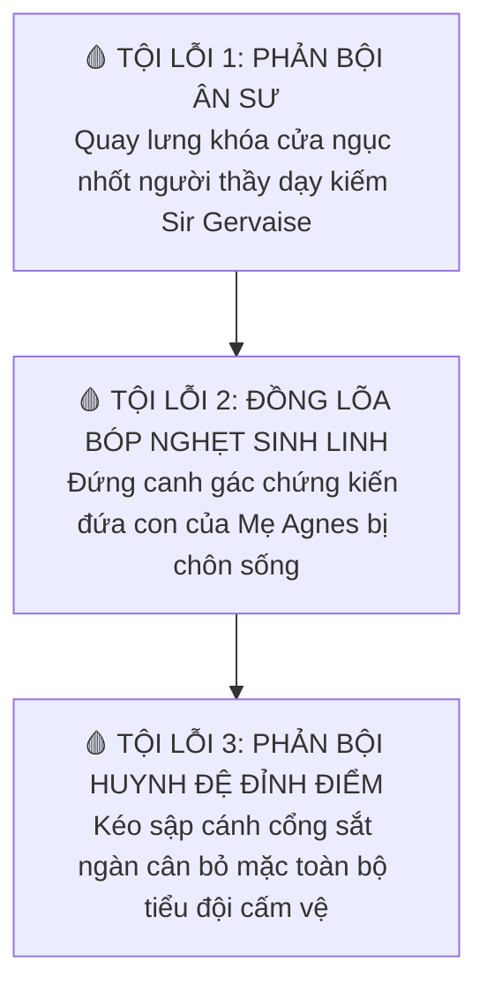
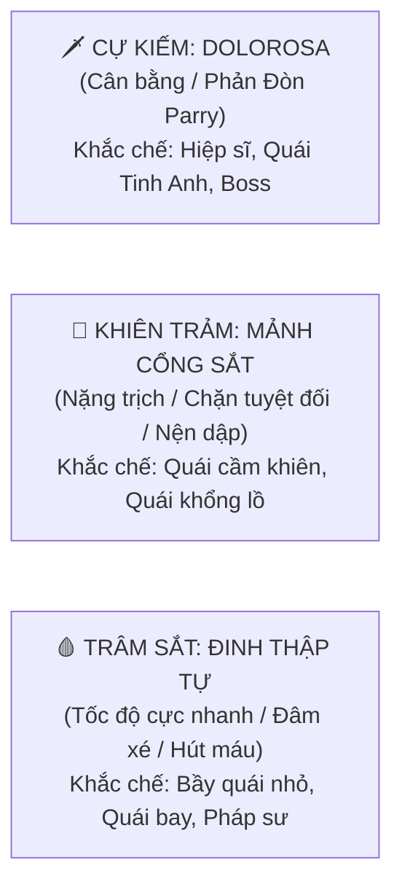
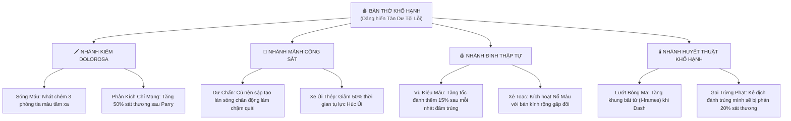
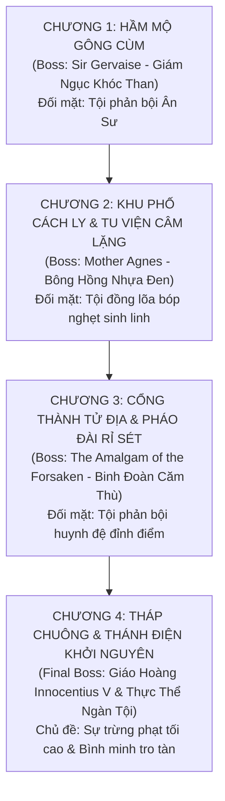
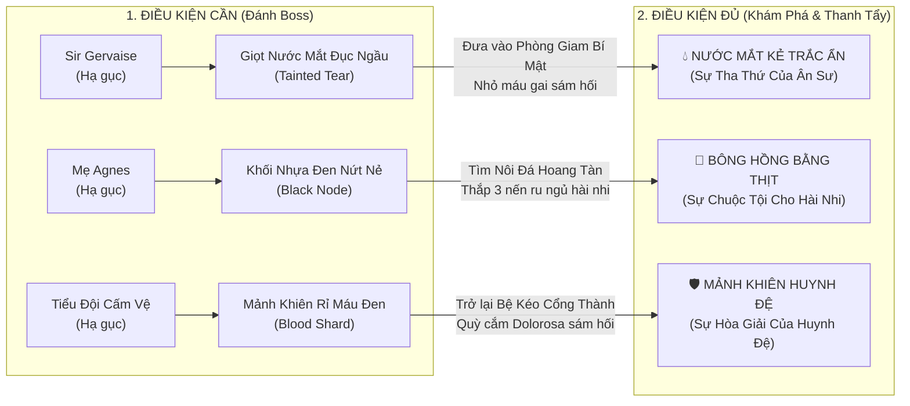
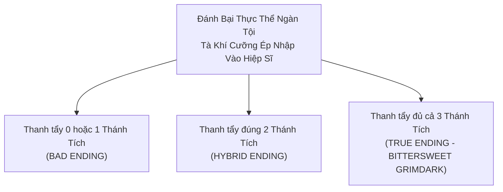

# 🩸 KỊCH BẢN & CỐT TRUYỆN TOÀN TẬP: SIN EATER (KẺ NUỐT TỘI)
**Tác phẩm:** *SIN EATER: HIỆP SĨ KHỔ HẠNH (The Penitent)*  
**Thể loại:** Dark Fantasy Grimdark, Gothic Trung Cổ Thuần Túy (Pure Medieval Dark Fantasy)  
**Âm hưởng chủ đạo:** *Berserk* (Kentaro Miura), Lịch sử Dị giáo Trung cổ, Đại dịch Cái Chết Đen, Bi kịch của sự Cuồng Tín Tôn Giáo  
**Bộ Vũ Khí Định Mệnh:** Tam Vật Hành Tội (*Dolorosa* - *Mảnh Cổng Phản Bội* - *Đinh Đóng Thập Tự*)

---

## 🏛️ PHẦN 1: THẢM HỌA KHỞI NGUYÊN - ĐẠI LỄ RỬA TỘI ĐẪM MÁU

### 1.1. Vương Quốc Thần Quyền: Sancta Aurelia
Vương quốc Sancta Aurelia từng là cái nôi rực rỡ nhất của đức tin trung cổ. Dưới sự trị vì của Giáo Hoàng **Innocentius V**, giáo lý của **Chân Giáo Tinh Khiết (The Pure Faith)** chi phối từng hơi thở của người dân: từ việc ăn uống, yêu đương đến những lời nói hàng ngày.  
Nhưng sự thịnh vượng kéo theo sự suy đồi: giới quý tộc sa đọa trong tiệc tùng xa hoa, thương nhân gian dối trục lợi trên xương máu kẻ nghèo, binh lính cướp bóc nhân danh giáo hội, còn thứ dân chìm trong thù hận và dục vọng tăm tối.

### 1.2. Nghi Lễ Rửa Tội Cưỡng Ép Của Giáo Hoàng
- Nhìn thấy thần dân của mình ngày càng lún sâu vào vũng lầy tội lỗi, Giáo Hoàng Innocentius V — một kẻ sùng đạo đến mức mù quáng và cực đoan — rơi vào nỗi kinh hoàng tột độ. Lão tin rằng nếu không hành động lập tức, Cơn Thịnh Nộ Của Thượng Đế sẽ giáng hỏa ngục thiêu rụi toàn bộ vương quốc.
- Bỏ ngoài tai mọi lời can gián, vào đêm Trăng Máu, Giáo Hoàng cho triệu tập toàn bộ các giám mục, tăng lữ và đoàn hiệp sĩ xuống hầm mộ sâu nhất của Đại Thánh Điện để cử hành **"Đại Lễ Rửa Tội Vĩnh Hằng" (The Grand Rite of Purgation)**.
- **Bi Kịch Của Sự Ngạo Mạn Tôn Giáo:** 
  - Giáo hoàng dùng Chén Thánh cổ đổ đầy Nước Thánh vào hồ báp-têm lớn bằng đá cẩm thạch đen, đồng thanh đọc những bài thánh ca cổ xưa với tham vọng **dùng quyền năng thần thánh để cưỡng ép gột rửa toàn bộ tội lỗi của hàng vạn người dân cùng một lúc**.
  - Nhưng tội lỗi của con người không phải là bụi bặm có thể gột rửa bằng nước lạnh. Nỗi căm hờn, dục vọng, sự dối trá và máu của cả một vương quốc khi bị cưỡng ép nén chặt vào hồ nước thánh đã tạo ra một phản ứng kinh hoàng: **Nước thánh sôi sùng sục sủi bọt, biến thành bùn đen hôi thối nồng nặc mùi xác chết**.
  - Từ đáy hồ, nỗi thống khổ của hàng vạn tội nhân kết tinh lại thành một thực thể quái thai: **Thực Thể Ngàn Tội (The Primeval Sin)**. Ngọn gió dịch bệnh từ lòng đất bùng phát, biến lời nguyền tội lỗi thành hiện thực xác thịt tàn bạo:
    - *Kẻ tham lam:* Miệng nôn ra vàng nóng chảy nung chín lục phủ ngũ tạng.
    - *Kẻ bạo tàn:* Xương tự nứt toác, mọc ra gai sắt cào xé chính thịt da mình.
    - *Giáo hoàng và tăng lữ:* Bị bùn đen của hồ rửa tội nuốt chửng, biến đổi thành những quái vật thần quyền méo mó, mất hết nhân tính.

---

## 🗡️ PHẦN 2: CHÂN TƯỚNG HIỆP SĨ & BA NẤC THANG TỘI LỖI (THE THREE SINS)

### 2.1. Quá Khứ Ô Nhục & Ba Nợ Máu Cá Nhân
Nhân vật chính từng là Đội trưởng cấm vệ của **Hội Hiệp Sĩ Rỉ Sét (The Rustbound Order)**. Hành trình của anh **không phải là đi dọn dẹp hậu quả gián tiếp cho Giáo Hoàng**, mà là một cuộc **Hành Quyết Lương Tâm**, nơi anh phải trực tiếp đối diện với **từng tội lỗi cụ thể do chính bản thân đã gây ra trong quá khứ**:

1. **Tội Lỗi Thứ Nhất — Sự Vô Ơn Với Ân Sư (Sir Gervaise):**
   - Sir Gervaise từng là cựu Đại Đội Trưởng và là người thầy dạy kiếm đầu tiên thời niên thiếu của anh. Khi Giáo Hội ra lệnh phong tỏa hầm ngục bỏ mặc tù nhân chết đói, Gervaise đã lén mang bánh mì cứu tế. Nhân vật chính khi đó là viên sĩ quan trẻ đầy tham vọng, vì muốn lấy lòng Giám Mục để thăng tiến, **đã ngoảnh mặt làm ngơ trước lời cầu xin của thầy, thậm chí chính tay anh đã nhận lệnh đóng then cài cửa đá nhốt thầy mình bên dưới!**
2. **Tội Lỗi Thứ Hai — Sự Hèn Nhát Của Kẻ Đồng Lõa (Mẹ Agnes):**
   - Trong thời gian làm Đội Trưởng Cấm Vệ, anh nhận lệnh áp giải giám mục đến Tu Viện Câm Lặng để thanh tra vụ bê bối mang thai ngoài giá thú của Viện Mẫu Agnes.
   - Chính anh là kẻ **đã đứng canh gác ngoài cánh cửa mật thất**, nghe thấy tiếng van xin quỳ lạy của người mẹ và tiếng khóc nghẹn ngào của đứa trẻ sơ sinh khi bị thợ hồ trát vữa bức tường đá chôn sống. Vì sợ mất danh vọng và bị kết tội dị giáo, anh đã im lặng trơ mắt đồng lõa với tội ác.
3. **Tội Lỗi Thứ Ba — Sự Đào Ngũ Ô Nhục Đỉnh Điểm (Tiểu Đội Cấm Vệ):**
   - Đêm Đại Lễ Rửa Tội sụp đổ, nhìn thấy bùn đen nuốt chửng các giám mục, nỗi sợ hãi hèn hạ đã đánh gục danh dự hiệp sĩ. Anh hoảng loạn bỏ chạy và **kéo sập cánh cổng sắt ngàn cân**, nhốt chặt người Đội Phó trung thành cùng toàn bộ anh em binh lính ở lại trong lòng địa ngục.

### 2.2. Sự Biến Đổi Của Tội Lỗi & Lời Thề Khổ Hạnh
Tỉnh dậy giữa đống tro tàn hoang phế, cơ thể anh bị dịch bệnh tội lỗi xâm thực dữ dội. Theo quy luật siêu nhiên tàn khốc của Sancta Aurelia: *Nỗi ám ảnh tội lỗi sâu kín nhất trong tâm can sẽ biến đổi thể xác thành hình dạng quái thai tương ứng*.

Chính **mặc cảm tội lỗi tột cùng về 3 món nợ máu** đã biến đổi anh:
1. **Bộ Giáp Gai Nhục Nhã (The Flesh of Thorns):**
   - Anh **không hề tìm thấy hay nhặt bộ giáp này ở đâu cả**. Cơn dịch bệnh tội lỗi đã nung chảy bộ giáp cấm vệ bằng thép trên người anh, hòa lẫn sắt thép hoen rỉ vào da thịt và xương tủy.
   - Hàng ngàn chiếc gai sắt mọc ngược đâm sâu vào da thịt. Chiếc nón sắt cấm vệ bị kim loại nóng chảy hàn chết kín mít, bịt kín đôi mắt của kẻ từng hèn nhát quay lưng bỏ chạy.
   - **Mỗi cử động là một hình phạt:** Mỗi bước chân chạy nhảy, mỗi cú vung vũ khí, gai sắt lại nghiến sâu vào thịt nát, xé toạc vết thương rỉ máu tươi — chiếc roi trừng phạt sống động nhắc nhở anh về 3 tội lỗi tày trời.
2. **Sự Trớ Trêu Của Dịch Bệnh (The Cursed Symbiosis):**
   - Cơn dịch bệnh vừa đày đọa, lại vừa là thứ níu giữ sinh mạng anh lại. Dịch bệnh liên tục kết vảy hàn gắn miệng vết thương, **không cho anh được quyền chết** cho đến khi anh hoàn thành con đường chuộc tội!

---

## 🔱 PHẦN 3: TAM VẬT HÀNH TỘI & HOẠT ẢNH KẾT LIỄU [E] RIÊNG BIỆT

> [!TIP]
> **Triết Lý Thiết Kế:**  
> - **Chiến đấu:** Tách bạch vũ khí khỏi việc giải đố bản đồ để giữ Map tinh gọn, không sa bẫy Scope Creep.  
> - **Cắt cảnh Kết Liễu [E]:** Hoạt ảnh kết liễu Boss biến đổi **100% theo vũ khí người chơi đang cầm trên tay**, ghi nhận phong cách chiến đấu của người chơi!

---

### 🗡️ 1. CỰ KIẾM: DOLOROSA (LƯỠI KIẾM SẦU BI)
* **Bản chất:** Thanh kiếm cấm vệ hai tay năm xưa nay hoen rỉ, chuôi kiếm đúc bằng sắt gai cắm trực tiếp vào cổ tay phải rút máu người chơi để tôi luyện đường gươm.
* **Phong cách:** Cân bằng, đĩnh đạc, hiệp sĩ mẫu mực nhưng thấm đẫm bi kịch.
* **Cơ chế đặc quyền - PARRY (Phản Đòn Máu):** Giơ bản kiếm to chặn đòn. Đỡ trúng đòn quái đúng khoảnh khắc sẽ phát ra tiếng **"KENGGG!"**, tia lửa lóe sáng làm quái khựng người (Stun), Hiệp sĩ lập tức xoay người tung nhát chém chí mạng phụt máu đen.
* **🎬 Hoạt cảnh Kết Liễu [E] khi cầm DOLOROSA (Nhát Trảm Sầu Bi):**
  - Hiệp sĩ đứng nghiêm cẩn, cúi đầu mặc niệm cho nạn nhân. Anh dồn toàn lực vung một nhát chém vòng cung tuyệt mỹ xé toạc khối tà khí.
  - Máu tươi từ rãnh kiếm rỉ ra thấm đẫm vết thương của Boss, chia sẻ nỗi đau và giải thoát linh hồn họ bay lên trong sự thanh thản.

---

### 🚪 2. KHIÊN TRẢM: MẢNH CỔNG PHẢN BỘI (THE GATE OF TREASON)
* **Bản chất:** Một mảng cánh cổng sắt ngàn cân cao 1.6m mà chính tay anh kéo sập nhốt đồng đội năm xưa, mang theo cả then cài gãy và vết cào móng tay đẫm máu khô của huynh đệ. Khi không dùng thì vác sau lưng như **tấm bia mộ khổng lồ**.
* **Phong cách:** Nặng trịch, tàn bạo, rung chuyển mặt đất, đè bẹp mọi lớp giáp.
* **Cơ chế đặc quyền - HÚC ỦI & BỨC TƯỜNG SẮT KHÔNG THỂ XUYÊN PHÁ:**
  - *Tụ lực (Húc Ủi):* Núp sau cánh cổng phóng thẳng tới trước 3 mét như xe ủi bọc thép, tông nát khiên chắn kẻ địch.
  - *Giữ nút Thủ:* Cắm phập mảng cổng xuống đất. Chặn đứng 100% sát thương đòn đánh vật lý của Boss.
* **🎬 Hoạt cảnh Kết Liễu [E] khi cầm MẢNH CỔNG SẮT (Nghiền Nát Sự Giam Cầm):**
  - Hiệp sĩ nhấc bổng mảng cổng sắt ngàn cân lên quá đầu, dồn toàn bộ sức nặng và lòng căm thù tội lỗi đập thẳng mép đáy xuống sàn đá $\rightarrow$ **RẦM!**
  - Dùng chính biểu tượng của sự giam cầm năm xưa để **nghiền nát xiềng xích / lồng sọ / vách đá** đang giam hãm Boss, phá tan ngục tù cho linh hồn họ thoát ra!

---

### 🩸 3. CẶP TRÂM SẮT: ĐINH ĐÓNG THẬP TỰ (THE CRUCIFIXION NAILS)
* **Bản chất:** Hai chiếc đinh sắt cổ xưa dài 40cm được **đóng xuyên thẳng qua mu bàn tay và thấu ra lòng bàn tay** của người hiệp sĩ, nhô dài ra như cặp móng vuốt sói bằng sắt đẫm máu.
* **Phong cách:** Tốc độ kinh hoàng, cận chiến dồn dập, cào xé điên loạn như dã thú trong cơn đau hành xác.
* **Cơ chế đặc quyền - CUỒNG LOẠN HÚT MÁU (Blood Frenzy):** Tốc độ đánh và di chuyển nhanh hơn 30%. Đâm trúng quái sẽ hút máu kẻ thù để nuôi dưỡng thể xác đang thối rữa của hiệp sĩ.
* **🎬 Hoạt cảnh Kết Liễu [E] khi cầm ĐINH THẬP TỰ (Đồng Thống Khổ - Chia Sẻ Cực Hình):**
  - Hiệp sĩ không vung vũ khí chém giết. Anh lao tới **ôm chặt lấy thân xác quái vật**, cắm sâu 2 chiếc đinh xuyên qua cơ thể mục ruỗng của họ.
  - Hiệp sĩ gào thét trong đau đớn dữ dội khi **dùng chính cơ thể mình cưỡng ép hút sạch lượng bùn đen ô uế ra khỏi linh hồn nạn nhân**. Boss rũ bỏ tà khí ra đi nhẹ nhõm, còn hiệp sĩ nhận trọn cơn đau đớn giằng xé vào da thịt mình.

---

### 🌳 CÂY KỸ NĂNG TINH GỌN: "BÀN THỜ KHỔ HẠNH" (TREE OF PENANCE)
Người chơi dùng **Tàn Dư Tội Lỗi (Sin Fragments)** thu được từ việc tiêu diệt quái vật để mở khóa các nâng cấp tinh gọn tại Bàn Thờ Khổ Hạnh:

---

## 🗺️ PHẦN 4: KỊCH BẢN CHI TIẾT 4 CHƯƠNG - ĐỐI MẶT TỪNG TỘI LỖI

---

### 🏛️ CHƯƠNG 1: HẦM MỘ GÔNG CÙM (THE WEEPING CATACOMBS)
* **Bối cảnh:** Hầm ngục ngầm sâu hun hút dưới chân thành phố. Nơi giam giữ những tử tù bị lãng quên, tường chất đầy xương sọ của tù nhân chết đói.
* **Boss: Sir Gervaise - Giám Ngục Khóc Than (Ân Sư Của Hiệp Sĩ)**
  - *Mối liên kết cá nhân:* Sir Gervaise từng là người thầy dạy kiếm cho nhân vật chính. Khi Giáo Hội phong tỏa hầm ngục bỏ đói tử tù, chính nhân vật chính năm xưa vì muốn lấy lòng Giám Mục đã **ngoảnh mặt làm ngơ trước lời cầu xin của thầy, thậm chí chính tay anh nhận lệnh đóng then cài cửa đá nhốt thầy mình bên dưới!**
  - *Hình dạng:* Gã khổng lồ cõng một chiếc lồng sọ lớn trên lưng, hốc mắt liên tục tuôn ra máu đen của sự cắn rứt và đau đớn.
  - *Thoại trước trận đánh (Nhận ra học trò cũ):*
    > *(Gervaise chớp đôi mắt rỉ máu đen, nhìn vào dáng đứng của bạn)*  
    > *"Thế đứng này... đường gươm này... Ta đã từng dạy ngươi vung kiếm lên để bảo vệ kẻ yếu hèn, chứ không phải để ngoảnh mặt cài then cửa đá năm xưa...*  
    > *Ngươi trở lại đây để tiễn biệt người thầy già này sao, đồ học trò phản phúc?"*
  - *Cắt cảnh Kết Liễu [E]:* Người chơi bấm [E] kích hoạt hoạt cảnh kết liễu tùy biến theo vũ khí đang cầm (DOLOROSA / Cổng Sắt / Đinh Thập Tự). Gervaise trước khi tan biến thì thào: *"Đường kiếm... cuối cùng đã chuẩn xác rồi... con trai..."*
  - **Vật phẩm rơi ra (Điều kiện cần):** 
    > 💧 **Tàn Tích 1: Giọt Nước Mắt Đục Ngầu (The Tainted Tear)**  
    > *Mô tả: Giọt lệ kết tinh thành đá chứa đầy oán khí của những tử tù chết đói và nỗi đau bị người học trò phản bội.*

---

### 🕯️ CHƯƠNG 2: KHU PHỐ CÁCH LY & TU VIỆN CÂM LẶNG (THE PLAGUED CLOISTER)
* **Bối cảnh:** Khu phố nghèo bị thiêu rụi dẫn vào Tu Viện dòng Nữ Tu khấn Lời Thề Im Lặng. Khói nến mỡ người mịt mù, chuông gió bằng xương kêu ai oán trong gió buốt.
* **Boss: Mẹ Bề Trên Agnes - Bông Hồng Nhựa Đen (Nạn Nhân Của Sự Đồng Lõa)**
  - *Mối liên kết cá nhân:* Năm xưa, chính nhân vật chính là kẻ **đứng gác ngoài cánh cửa mật thất tu viện**, trơ mắt nhìn các linh mục giật đứa con sơ sinh khỏi tay Agnes và trát vữa bức tường đá chôn sống đứa bé để giữ "thanh danh đồng trinh" cho tu viện. Anh đã nghe trọn vẹn tiếng khóc xé ruột của đứa trẻ mà không dám can ngăn vì sợ bị kết tội dị giáo.
  - *Hình dạng:* Một bức tượng sứ trắng nứt toác, từ mọi kẽ nứt không ngừng tuôn ra nhựa đen quánh đặc như máu đông.
  - *Thoại trước trận đánh (Nhận ra kẻ gác cổng năm xưa):*
    > *(Agnes giơ bàn tay rỉ nhựa đen run rẩy chỉ vào bạn)*  
    > *"Ta nhận ra ngươi rồi... chiếc áo giáp cấm vệ lạnh tanh ấy!*  
    > *Kẻ đã đứng ngoài cánh cửa ngày hôm đó... kẻ trơ mắt nhìn con ta bị vùi lấp vào vách đá câm lặng!*  
    > *Lưỡi kiếm của ngươi tanh nồng mùi tội ác của kẻ đồng lõa hèn nhát! HÃY ĐỂ SÁP NẾN NÀY BỊT KÍN MẮT NGƯƠI!"*
  - *Cắt cảnh Kết Liễu [E]:* Kích hoạt đòn kết liễu theo vũ khí đang cầm. Vách đá vôi nứt toác, linh hồn đứa trẻ được giải thoát. Agnes mỉm cười gục xuống: *"Con ta... nó đã ấm lại rồi..."*
  - **Vật phẩm rơi ra (Điều kiện cần):** 
    > 🌹 **Tàn Tích 2: Khối Nhựa Đen Nứt Nẻ (The Fractured Black Node)**  
    > *Mô tả: Một khối sáp nến đen đặc như hắc ín, bên trong giam giữ tiếng khóc hờn ai oán của một sinh linh chưa từng được nhìn thấy ánh mặt trời.*

---

### ⚙️ CHƯƠNG 3: CỔNG THÀNH TỬ ĐỊA & PHÁO ĐÀI RỈ SÉT (THE GATE OF BETRAYAL)
* **Bối cảnh:** Cánh cổng thành sắt ngàn cân — nơi chính tay người chơi kéo cần gạt sập cửa năm xưa. Phía ngoài cổng là một bãi chiến trường hoen rỉ ngập tràn vũ khí gãy, khiên nứt và cờ hiệu rách nát của Hội Hiệp Sĩ Cấm Vệ.
* **Boss: THỰC THỂ CĂM THÙ CỦA TIỂU ĐỘI CẤM VỆ (THE AMALGAM OF THE FORSAKEN)**
  - *Mối liên kết cá nhân:* Toàn bộ tiểu đội cấm vệ và người Đội Phó trung thành nhất — những người anh em vào sinh ra tử bị chính nhân vật chính bỏ rơi ngoài tử địa để cứu mạng mình.
  - *Hình dạng:* Khối thịt và giáp sắt quằn quại cao 4 mét, phần thân trên là Người Đội Phó cầm ngọn cờ rách nát, xung quanh là hàng chục khuôn mặt binh lính gào thét tên bạn:
  - *Thoại trước trận đánh:*
    > *(Hàng chục cái miệng trên cơ thể quái vật cùng gầm rít căm phẫn)*  
    > *"Đội trưởng... Đội trưởng ơi..."*  
    > *"Mười đầu ngón tay chúng tôi đã gãy nát trên cánh cổng sắt này... Máu chúng tôi đã khô cứng trên ổ khóa của ngài..."*  
    > *(Người Đội Phó giơ lưỡi gươm gãy chỉ thẳng vào mặt bạn)*  
    > *"Ngài quay lại để làm gì? Để xem chúng tôi chết nhục nhã ra sao ư? HÃY HÒA LÀM MỘT VỚI CHÚNG TÔI ĐI, ĐỘI TRƯỞNG!"*
  - *Cắt cảnh Kết Liễu [E]:* Đòn kết liễu bộc phát theo vũ khí đang cầm. Khối thực thể tan rã, hàng chục linh hồn hóa thành đốm sáng trắng bay lên. Người Đội Phó gật đầu nhẹ trước khi tan biến: *"Cánh cổng... cuối cùng đã mở rồi, Đội trưởng..."*
  - **Vật phẩm rơi ra (Điều kiện cần):** 
    > 🛡️ **Tàn Tích 3: Mảnh Khiên Rỉ Máu Đen (The Blood-Stained Shard)**  
    > *Mô tả: Mảnh khiên sắt cấm vệ vỡ nát, phủ đầy máu đen khô cứng của những người anh em bị bỏ rơi.*

---

### 👑 CHƯƠNG 4: THÁP CHUÔNG & THÁNH ĐIỆN KHỞI NGUYÊN (THE ABYSSAL SANCTUM)
* **Bối cảnh:** Đỉnh cao nhất của thành phố dưới bầu trời trăng máu khổng lồ. Hồ Báp-têm ngập bùn đen sôi sùng sục.
* **Trùm Bán Kết: Giáo Hoàng Innocentius V (The Corrupted Pontiff)**
  - Kẻ đứng đầu sự cuồng tín, hai tay hàn dính vào trượng thánh nứt toác. Bị đánh bại, lão ngã nhào vào hồ báp-têm đen, cơ thể bị khối u Tội Lỗi nuốt chửng làm vật tế.
* **Trùm Cuối: Thực Thể Ngàn Tội (The Primeval Sin)**
  - Hiện thân của toàn bộ dục vọng, tội lỗi và sự cuồng tín của hàng vạn người dân Sancta Aurelia trỗi dậy từ đáy hồ đen.

---

## 🌟 PHẦN 5: HỆ THỐNG THÁNH TÍCH - "ĐIỀU KIỆN CẦN" VÀ "ĐIỀU KIỆN ĐỦ"

* 💧 **Thánh Tích 1: Nước Mắt Kẻ Trắc Ẩn:** Người chơi chém vỡ bức tường đá nứt trong Hầm Mộ, vào *Phòng Giam Cuối Cùng*, đặt giọt nước mắt lên bàn thờ mục nát của Sir Gervaise và nhỏ máu gai sám hối $\rightarrow$ Tẩy sạch bùn đen, nhận được sự tha thứ của Ân Sư.
* 🌹 **Thánh Tích 2: Bông Hồng Bằng Thịt:** Dùng Double Jump vượt gác chuông vào *Vườn Hoa Cấm*, đặt khối nhựa đen vào chiếc nôi đá trẻ em và thắp 3 cây nến trắng $\rightarrow$ Nhựa đen tan chảy nảy mầm thành đóa hoa hồng đỏ thắm, chuộc tội cho sự im lặng hèn nhát năm xưa.
* 🛡️ **Thánh Tích 3: Mảnh Khiên Huynh Đệ:** Quay lại *Bệ Kéo Cổng Thành* (nơi chính tay mình từng kéo sập cửa), cắm vũ khí quỳ gối sám hối và mở khóa rương cờ hiệu của tiểu đội $\rightarrow$ Cánh cổng sắt mở toang, mảnh khiên phục hồi ánh đồng thau sáng ngời, xóa bỏ món nợ máu phản bội.

---

## ⚖️ PHẦN 6: BA KẾT CỤC DỰA TRÊN THÁNH TÍCH ĐÃ THANH TẨY

---

### 🌑 1. BAD ENDING: VỊ THẦN CỦA NỖI ĐAU MÉO MÓ (THE IDOL OF AGONY)
* **Điều kiện:** Thanh tẩy 0 hoặc chỉ 1 Thánh Tích (Người chơi chỉ chăm chăm đánh boss về nước).
* **Diễn biến:**
  - Không có đủ chúc phúc nhân tính bảo vệ, tâm trí Hiệp Sĩ bị khối Tội Lỗi đè bẹp và nuốt chửng hoàn toàn.
  - Chiếc nón sắt mọc ra gai đen đâm xuyên hộp sọ. Anh bước lên ngai vàng của Giáo Hoàng Innocentius V, trở thành **Tân Tội Thần (The New God of Penance)**.
  - Truyền bá tà thuyết tàn khốc mới: *"Chỉ có hành xác, đau đớn tột cùng và máu chảy mới gột rửa được tội lỗi trần gian"*. Vương quốc chìm vào đêm trường cuồng tín tăm tối hơn gấp bội.

---

### 🗿 2. HYBRID ENDING: LIỆT SĨ HÓA ĐÁ (THE STONE MARTYR)
* **Điều kiện:** Thanh tẩy đúng 2 Thánh Tích (Đa số người chơi lần đầu sẽ gặp kết này).
* **Diễn biến:**
  - Hai Thánh Tích bừng sáng bảo vệ một phần linh hồn, **vừa đủ để giữ cho tâm trí của Hiệp Sĩ không bị tha hóa**, nhưng không đủ sức thanh tẩy hoàn toàn khối tà ác.
  - Trong giây phút tỉnh táo cuối cùng, Hiệp Sĩ cắm ngập vũ khí xuống đáy hồ Báp-têm, tự biến bản thân thành một chiếc lồng giam.
  - **Toàn bộ cơ thể anh từ từ hóa đá.** Gai sắt, áo giáp và máu thịt biến thành đá hoa cương đen vĩnh cửu, giam giữ Thực Thể Ngàn Tội trong lồng ngực mình.
  - *Hậu quả:* Bức tượng người hiệp sĩ cô độc đứng sừng sững trên đỉnh tháp chuông ngàn năm, gánh chịu nỗi đau giằng xé trong câm lặng dưới bầu trời xám xịt tro tàn.

---

### 🌅 3. TRUE ENDING: BÌNH MINH TRO TÀN & BƯỚC CHÂN TRẦN CỦA CON NGƯỜI (THE ASHEN DAWN)
* **Điều kiện:** Người chơi giải mã toàn bộ bí mật và **hoàn thành thanh tẩy đủ cả 3 Thánh Tích Của Sự Thật**.
* **Diễn biến (Chuẩn Bittersweet Grimdark - Tuyệt đối không cổ tích hóa):**
  - Khi Thực Thể Ngàn Tội tràn vào lồng ngực Hiệp Sĩ, **cả 3 Thánh Tích đồng loạt bùng nổ hào quang rực rỡ**:
    - *Sự Tha Thứ của Ân Sư Gervaise*
    - *Sự Chuộc Tội cho Hài Nhi và Mẹ Agnes*
    - *Sự Hòa Giải Máu của Huynh Đệ Cấm Vệ*
  - Ba món nợ máu cá nhân được gột rửa bằng chính máu và sự sám hối chân thành. Ánh sáng thánh khiết bùng lên từ cự kiếm **DOLOROSA**, xuyên thủng màn đêm, **thanh tẩy hoàn toàn Thực Thể Ngàn Tội từ bên trong ra ngoài**!
  - Hồ nước thánh đen ngòm biến thành làn nước trong vắt. Mây đen cuồng nộ tan biến, những tia nắng bình minh đầu tiên sau hàng thế kỷ rọi chiếu xuống Sancta Aurelia.
  
* **Thực Tại Tàn Nhẫn Của Bình Minh (Bittersweet Reality):**
  - **Mặt trời không hé lộ một thiên đường mộng mơ, mà rọi chiếu lên một hiện thực trần trụi và đau xót:**
    - Toàn bộ vương quốc Sancta Aurelia đã hoàn toàn **đổ nát, hoang tàn**.
    - Các thánh đường nguy nga nay chỉ còn là những cột đá đổ gãy và đống gạch vụn cháy đen. Tro tàn bay lơ lửng trong gió sớm, xương trắng của những kẻ chết đói chất đống khắp các góc phố.
    - Những người sống sót chui ra từ các hầm tối không hề có tiếng reo hò rạng rỡ hay nụ cười tươi tắn. Họ là **những con người tàn tạ, gầy gò ốm yếu, rách rưới, run rẩy và kiệt quệ**. Họ đã mất đi toàn bộ gia đình, của cải, và mất đi cả vị thần/giáo hội mà họ từng quỳ lạy van xin.
  - **Ý Nghĩa Nhân Văn Cốt Lõi:**
    - Cứu rỗi không phải là xóa sạch quá khứ hay ban phát phép màu, mà là **trả lại cho họ Quyền Làm Người**.
    - Không còn tà giáo, không còn những lời nguyền ma quỷ hay sự thao túng của thần quyền giả tạo để họ bấu víu hay đổ lỗi.
    - Giờ đây, những con người sống sót phải **tự đứng trên đôi chân trần rướm máu của mình để dọn dẹp đống tro tàn thực tế, tự tay gieo lại từng hạt giống để xây dựng lại cuộc đời**.

* **Khoảnh Khắc Yên Nghỉ Cuối Cùng Của Hiệp Sĩ Khổ Hạnh:**
  - Món nợ máu đã trả sạch. Toàn bộ gai nhọn đâm xuyên cơ thể Hiệp Sĩ và lớp giáp sắt nứt toác tự động vỡ vụn, rơi rụng leng keng xuống sàn đá lạnh.
  - Chiếc nón sắt bịt mắt nứt đôi rơi xuống, để lộ gương mặt hốc hác nhưng mang một **nụ cười thanh thản tuyệt đối**. Lời nguyền bất tử của dịch bệnh chấm dứt.
  - Anh không đứng dậy ăn mừng; anh từ từ quỵ gối, gục đầu bên thanh cự kiếm DOLOROSA đã nguội lạnh và **trút hơi thở cuối cùng trong sự bình yên như một con người bình thường**.
  - Một đứa trẻ mồ côi bước đến ngập ngừng giữa đống đổ nát, cúi xuống nhặt một bông hoa dại nhỏ bé vừa mọc lên giữa khe đá tro tàn, đặt nhẹ vào bàn tay buông thõng rướm máu của người hiệp sĩ.
  - Khung hình từ từ lùi xa: Bóng lưng bất động của người hiệp sĩ quỳ gối giữa quảng trường hoang tàn, tắm mình trong ánh nắng ban mai rọi rực rỡ qua màn tro bụi.
