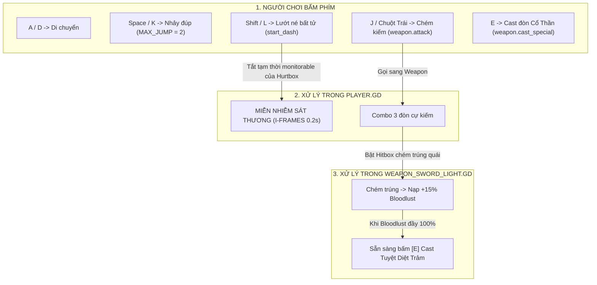

# 📖 SỔ TAY GIẢI MÃ KIẾN TRÚC CODE: ASHEN DAWN (HÔI TẪN LÊ MINH)
### *(Dành riêng cho bạn - Người mới bắt đầu, không cần biết sâu về code vẫn hiểu 100%)*

> **Chào bạn!** Cuốn sổ tay này được biên soạn để bạn làm chủ toàn bộ kiến trúc mã nguồn trong dự án.  
> Dù bạn mở code trên máy tính nào, bạn cũng sẽ hiểu ngay từng file, từng dòng lệnh đang làm nhiệm vụ gì trên sân khấu game!

---

## 🗺️ 1. BẢN ĐỒ DỰ ÁN THỰC TẾ (CẬP NHẬT CHUẨN XÁC)

Dự án hiện tại được tổ chức theo kiến trúc **Component-Based (Kiến trúc Thành phần)** sạch sẽ và chuẩn mực của Godot 4:

| Đường dẫn File | Loại | Nhiệm vụ thực tế trong Game |
| :--- | :--- | :--- |
| [`scenes/test_stage.tscn`](file:///d:/Project/sin-eater/scenes/test_stage.tscn) | Scene | **Sân khấu thử nghiệm (Sandbox)**: Chứa sàn đá, tường biên 2 bên, bục nhảy trên cao, Player và Bù nhìn. |
| [`scenes/player.tscn`](file:///d:/Project/sin-eater/scenes/player.tscn) | Scene | **Hình thể Hiệp Sĩ**: Gồm khối va chạm thân thể (`CharacterBody2D`), khối hình ảnh hiển thị (`Visual`), Thần Khí gắn trên tay và vùng nhận đòn (`HurtBox`). |
| [`scripts/player.gd`](file:///d:/Project/sin-eater/scripts/player.gd) | Script | **Não bộ di chuyển & phản xạ**: Điều khiển chạy (`A`/`D`), Nhảy đúp (`jump`), Lướt né bất tử I-frames (`dash`), và lắng nghe lệnh Parry/Attack. |
| [`scripts/weapons/base_weapon.gd`](file:///d:/Project/sin-eater/scripts/weapons/base_weapon.gd) | Script | **Lớp Cơ Sở Thần Khí (Base Class)**: Khuôn mẫu chung cho mọi vũ khí Cổ Thần. Quy định các hành động: Chém thường, Lướt chém, Parry, và Cast đòn đặc biệt khi đầy Khát Máu. |
| [`scripts/weapons/weapon_sword_light.gd`](file:///d:/Project/sin-eater/scripts/weapons/weapon_sword_light.gd) | Script | **Thần Khí Khởi Đầu: Kiếm Đơn Ánh Sáng**: Quản lý chuỗi Combo 3 nhát chém, Lướt chém, thanh Khát Máu (`bloodlust`), phản đòn Parry và đòn đặc biệt [E]. |
| [`scenes/Dummy.tscn`](file:///d:/Project/sin-eater/scenes/Dummy.tscn) | Scene | **Bù nhìn tập đánh**: Mục tiêu thử nghiệm để test sát thương, kiểm tra va chạm đòn đánh. |
| [`scripts/dummy.gd`](file:///d:/Project/sin-eater/scripts/dummy.gd) | Script | **Bộ nhận đòn của Bù nhìn**: Lắng nghe đòn chém từ Hurtbox, trừ máu, chớp trắng báo hiệu bị trúng đòn. |
| [`scripts/combat/hitbox.gd`](file:///d:/Project/sin-eater/scripts/combat/hitbox.gd) | Script | **Lưỡi Kiếm (Vùng gây sát thương)**: `Area2D` mang thông số sát thương, lực đẩy lùi (`knockback_force`) và lượng nạp máu (`bloodlust_gain`). |
| [`scripts/combat/hurtbox.gd`](file:///d:/Project/sin-eater/scripts/combat/hurtbox.gd) | Script | **Da Thịt (Vùng nhận đòn)**: `Area2D` nhận diện khi bị Hitbox chém trúng và phát tín hiệu `hit_received`. Có thể tắt bật để tạo bất tử khi lướt (I-frames). |

---

## ⚡ 2. CƠ CHẾ COMBAT VẬN HÀNH TRONG CODE NHƯ THẾ NÀO?



### 1. Cơ chế Lướt Né Bất Tử (I-Frames Dash):
Trong file [`scripts/player.gd`](file:///d:/Project/sin-eater/scripts/player.gd):
```gdscript
func start_dash() -> void:
    is_dashing = true
    can_dash = false
    # Tắt khả năng nhận diện va chạm của Hurtbox -> BẤT TỬ!
    if hurtbox:
        hurtbox.set_deferred("monitorable", false) 
    await get_tree().create_timer(DASH_DURATION).timeout
    # Hết thời gian lướt -> Bật lại Hurtbox bình thường
    if hurtbox:
        hurtbox.set_deferred("monitorable", true)
    is_dashing = false
```

### 2. Cơ chế Khát Máu & Đòn Đặc Biệt (Bloodlust & Eldritch Cast):
Trong file [`scripts/weapons/weapon_sword_light.gd`](file:///d:/Project/sin-eater/scripts/weapons/weapon_sword_light.gd):
- Mỗi lần chém trúng quái vật, biến `bloodlust` tăng dần từ `0` đến `100`.
- Khi `bloodlust >= 100`: Thần Khí bùng nổ sức mạnh Cổ Thần, cho phép người chơi bấm **[E]** gọi hàm `cast_special()`:
  - Vung đòn Tuyệt Diệt Trảm gây sát thương cực lớn.
  - Kích hoạt **Hit-stop (0.08s)** khựng hình đanh thép và rung giật màn hình.
  - Reset `bloodlust` về 0 để bắt đầu chu kỳ nạp máu mới.

### 3. Cơ chế Đa Thần Khí (Multi-Weapon System):
- Vì [`player.gd`](file:///d:/Project/sin-eater/scripts/player.gd) chỉ giao tiếp với lớp trừu tượng `BaseWeapon`, sau này khi bạn thêm **Cặp Vuốt Sắt Bóng Tối** (`weapon_shadow_claws.gd`) hoặc **Lưỡi Liềm Đói Khát** (`weapon_hunger_scythe.gd`), bạn chỉ việc tráo đổi node vũ khí mà **không cần sửa một dòng code di chuyển nào của Player**!

### 4. Kiến trúc State Machine cho Boss 2 Phase:
Khi viết code cho Boss ở máy nhà, bạn chỉ cần áp dụng mô hình Máy trạng thái (FSM):
```gdscript
enum BossPhase { PHASE_1_WIELDER, TRANSITION, PHASE_2_UNBOUND_GOD, DEFEATED }
var current_phase = BossPhase.PHASE_1_WIELDER

func _on_hurtbox_hit_received(damage, knockback, bloodlust_gain):
    current_health -= damage
    if current_health <= 0:
        if current_phase == BossPhase.PHASE_1_WIELDER:
            start_phase_2_transition()
        else:
            trigger_boss_victory_and_reward()

func start_phase_2_transition():
    current_phase = BossPhase.TRANSITION
    # 1. Bật bất tử tạm thời
    hurtbox.set_deferred("monitoring", false)
    # 2. Rung camera, chạy hoạt ảnh xích phong ấn vỡ vụn
    # 3. Biến hình Cổ Thần bung xích, hồi đầy máu Phase 2
    current_health = max_health_phase_2
    hurtbox.set_deferred("monitoring", true)
    current_phase = BossPhase.PHASE_2_UNBOUND_GOD
```

---

## 💡 3. TỪ ĐIỂN CÁC THUẬT NGỮ GODOT QUAN TRỌNG

1. **`Area2D`**: Vùng không gian dùng để phát hiện va chạm (như Lưỡi kiếm `Hitbox` chạm vào Da thịt `Hurtbox`).
2. **`CharacterBody2D`**: Nút chuyên dụng cho nhân vật di chuyển 2D, hỗ trợ sẵn trọng lực, ma sát sàn và leo bục dốc.
3. **`signal`**: Chuông báo động của Godot. Khi một việc xảy ra (ví dụ: bị trúng kiếm), node con bắn tín hiệu rung chuông để node cha biết đường trừ máu.
4. **`await get_tree().create_timer(time).timeout`**: Lệnh tạm dừng thực thi một hàm trong đúng `time` giây (dùng để canh thời gian khựng đòn chém hoặc thời gian bất tử khi lướt).
5. **`Engine.time_scale`**: Tốc độ thời gian toàn game. Đặt bằng `0.0` hoặc `0.05` trong tích tắc sẽ tạo ra hiệu ứng **Hit-stop** (khựng hình chém sướng tay).

---

> 🎯 **Lời khuyên:** Cuốn sổ tay này mô tả chính xác những gì đang có trên máy của bạn. Hãy mở file này bất cứ lúc nào bạn cần tra cứu luồng hoạt động giữa các script!
