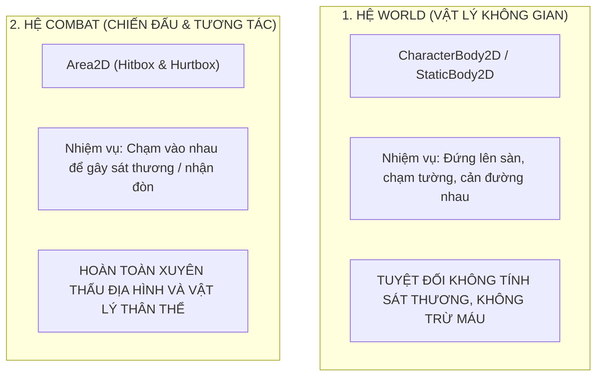

# 📖 SỔ TAY KIẾN THỨC KIẾN TRÚC & LẬP TRÌNH GAME (KNOWLEDGE BASE)
> **Dự án:** ASHEN DAWN: HÔI TẪN LÊ MINH  
> **Engine:** Godot 4.x (GDScript)  
> **Mục đích:** Đúc kết toàn bộ tư duy kiến trúc, công thức vật lý, nguyên tắc thiết kế combat và bài học thực chiến để tra cứu và học hỏi lâu dài.

---

## 📑 MỤC LỤC
1. [Chương 1: Kiến trúc Vật lý & Di chuyển (Locomotion & Delta Physics)](#-chương-1-kiến-trúc-vật-lý--di-chuyển-locomotion--delta-physics)
2. [Chương 2: Thiết kế Game Feel & Sức nặng đòn đánh (Attack Locomotion)](#-chương-2-thiết-kế-game-feel--sức-nặng-đòn-đánh-attack-locomotion)
3. [Chương 3: Quản lý Bất đồng bộ & Kỹ năng Lướt né (Dash & Coroutines)](#-chương-3-quản-lý-bất-đồng-bộ--kỹ-năng-lướt-né-dash--coroutines)
4. [Chương 4: Tư duy Cốt lõi Phân tầng Va chạm (Collision Layer & Mask Mastery)](#-chương-4-tư-duy-cốt-lõi-phân-tầng-va-chạm-collision-layer--mask-mastery)
5. [Chương 5: Clean Code & Nguyên lý Trách nhiệm Đơn lẻ (SRP in Game Dev)](#-chương-5-clean-code--nguyên-lý-trách-nhiệm-đơn-lẻ-srp-in-game-dev)

---

# 🚀 CHƯƠNG 1: KIẾN TRÚC VẬT LÝ & DI CHUYỂN (LOCOMOTION & DELTA PHYSICS)

### 1. Bản chất của hàm `move_toward(from, to, delta_step)`
Hàm `move_toward` trong Godot được thiết kế với **một cam kết tối thượng: TIẾN VỀ ĐÍCH VÀ TUYỆT ĐỐI KHÔNG BAO GIỜ BỊ VƯỢT QUÁ (NO OVERSHOOTING).**

```gdscript
# Cú pháp
move_toward(giá_trị_hiện_tại, giá_trị_đích, bước_nhảy_tối_đa_trong_frame_này)
```

#### Ruột bên trong hàm hoạt động như thế nào?
```gdscript
func move_toward(from: float, to: float, delta_step: float) -> float:
    var distance = abs(to - from)
    
    # NẾU KHOẢNG CÁCH CÒN LẠI <= BƯỚC NHẢY -> KHÔNG ĐƯỢC PHÉP TRỪ TIẾP, GÁN LUÔN BẰNG ĐÍCH!
    if distance <= delta_step:
        return to
        
    if from < to:
        return from + delta_step
    else:
        return from - delta_step
```

### 2. Tại sao `SPEED` trong hàm này bắt buộc phải nhân với `delta`?
- **Khái niệm `delta`:** Là khoảng thời gian (tính bằng giây) trôi qua giữa 2 khung hình liên tiếp:
  - Ở 60 FPS: $\text{delta} \approx \frac{1}{60} \approx 0.0167\text{ giây}$.
  - Ở 144 FPS: $\text{delta} \approx \frac{1}{144} \approx 0.0069\text{ giây}$.
- **Vận tốc vs Gia tốc:**
  - `SPEED` ($280\text{ px/s}$) là **Vận tốc**.
  - `SPEED * 2.0` ($560\text{ px/s}^2$) là **Gia tốc hãm (Deceleration rate)** tính trên **MỖI GIÂY**.
  - Để biết trong **1 FRAME DUY NHẤT** vận tốc được phép thay đổi bao nhiêu, ta áp dụng công thức vật lý cổ điển:
    $$\Delta v = a \times \Delta t \iff \text{bước\_nhảy} = (\text{Gia tốc}) \times \text{delta}$$

#### Điều gì xảy ra nếu QUÊN nhân `delta`?
Nếu viết `move_toward(velocity.x, target, SPEED * 2.0)`:
- Bước nhảy cho **1 FRAME** sẽ là $280 \times 2 = 560\text{ px}$!
- Khoảng cách từ chạy ($280$) về đứng yên ($0$) chỉ là $280\text{ px}$. Vì bước nhảy quá lớn ($560$), nhân vật sẽ bị **giật khựng lại cứng đờ ngay lập tức chỉ trong 0.016 giây**, mất hoàn toàn cảm giác quán tính mượt mà.
- Bị dính lỗi **Framerate Dependent** (máy mạnh hãm nhanh, máy lag hãm chậm).

> [!IMPORTANT]
> **Quy tắc vàng:** Bất cứ khi nào muốn một giá trị **tăng dần hoặc giảm dần mượt mà theo thời gian thực (giây)** trong `_physics_process`, tham số bước nhảy **bắt buộc phải nhân với `delta`**.

---

# ⚔️ CHƯƠNG 2: THIẾT KẾ GAME FEEL & SỨC NẶNG ĐÒN ĐÁNH (ATTACK LOCOMOTION)

### 1. Hiện tượng "Trượt patin / Trượt băng" (Ice-Skating Bug)
- **Nguyên nhân:** Logic di chuyển (`player.gd`) và logic vung kiếm (`weapon.gd`) chạy độc lập 100%. Người chơi bấm giữ phím chạy `D` và bấm chém `J`, nhân vật vừa phóng đi 280 px/s vừa vung kiếm chém, tạo cảm giác thiếu trọng lượng cơ thể và đòn đánh không có sức nặng.

### 2. Tư duy thiết kế: Đứng yên chém vs Dấn bước áp sát
Trong các game Action đỉnh cao (*Hollow Knight, Blasphemous*), người chơi cần 2 trạng thái rõ rệt:
1. **Đứng yên chém tại chỗ:** Khi buông phím di chuyển (`direction == 0`), nhân vật phải đứng nguyên vị trí để giữ khoảng cách an toàn, tránh vô tình bước chân vào bẫy gai hoặc hitbox của Boss.
2. **Dấn bước áp sát:** Khi giữ phím tiến (`direction != 0`), nhân vật phanh đà chạy và nhích nhẹ tới trước một khoảng nhỏ (`ATTACK_STEP_IMPULSE \approx 80\text{ px/s}`) để dồn trọng tâm và áp sát mục tiêu.

#### Cấu trúc code 2 tầng chuẩn mực:
```gdscript
# TẦNG 1: Kiểm tra trạng thái - ĐANG CHÉM KIẾM hay ĐANG CHẠY BÌNH THƯỜNG?
if weapon and weapon.is_busy:
    if is_on_floor():
        # TẦNG 2: Người chơi có chủ đích di chuyển khi chém hay không?
        if direction != 0:
            # Vừa chém vừa giữ phím -> Dấn nhẹ tới trước áp sát
            velocity.x = move_toward(velocity.x, facing_direction * attack_step_impulse, SPEED * delta * 2.0)
        else:
            # Buông phím -> Đứng im chém tại chỗ, không dấn bước
            velocity.x = move_toward(velocity.x, 0.0, SPEED * delta * 2.0)
else:
    # KHÔNG CHÉM -> Di chuyển bình thường theo phím bấm
    velocity.x = direction * SPEED
```

---

# 🏃 CHƯƠNG 3: QUẢN LÝ BẤT ĐỒNG BỘ & KỸ NĂNG LƯỚT NÉ (DASH & COROUTINES)

### 1. Cơ chế I-Frames (Invulnerability Frames)
- **Bản chất:** Trong game hành động, lướt né không chỉ là di chuyển nhanh, mà là thời điểm người chơi được **miễn nhiễm sát thương**.
- **Thực thi trong Godot:** Tắt tạm thời `monitorable` của Hurtbox:
  ```gdscript
  hurtbox.set_deferred("monitorable", false) # Bật bất tử!
  ```
- **Phản hồi thị giác (Visual Feedback):** Luôn phải thay đổi hình ảnh để người chơi biết mình đang bất tử, ví dụ giảm độ mờ Alpha xuống `0.4` (hóa bóng ma) và phục hồi về `1.0` khi kết thúc.

### 2. Rủi ro của `await get_tree().create_timer()` (Dangling Coroutines)
- `SceneTreeTimer` là một Timer độc lập gắn với toàn bộ Scene.
- **Rủi ro:** Nếu trong thời gian chờ timeout mà nhân vật bị chết, chuyển màn (`queue_free()`), hoặc kích hoạt hiệu ứng dừng hình (Hit-stop), coroutine vẫn sẽ thức dậy và cố gắng sửa biến của một Node đã bị giải phóng $\rightarrow$ Sinh lỗi Crash hoặc lỗi bóng ma trạng thái.
- **Giải pháp phòng vệ (Safe Guard):** Luôn kiểm tra `if not is_inside_tree(): return` ngay sau mọi lệnh `await`.

---

# 🛡️ CHƯƠNG 4: TƯ DUY CỐT LÕI PHÂN TẦNG VA CHẠM (COLLISION LAYER & MASK MASTERY)

### 1. Khẩu quyết vàng: "Tôi là ai" & "Tôi tìm ai"
```
┌────────────────────────────────────────────────────────────────────────┐
│ COLLISION LAYER = "TÔI LÀ AI?"       -> Danh tính, tầng tôi đang đứng.  │
│ COLLISION MASK  = "TÔI QUAN TÂM AI?"  -> Bộ lọc mắt nhìn của tôi.        │
└────────────────────────────────────────────────────────────────────────┘
```
> **Nguyên tắc tương tác của Engine:** Hai vật thể A và B **chỉ va chạm nhau** khi:
> **Mask của A chứa Layer của B** HOẶC **Mask của B chứa Layer của A**.

### 2. Hai Thế Giới Tách Biệt: WORLD vs COMBAT



### 3. Ma trận Va chạm Bất đối xứng (Hitbox - Hurtbox Pattern)

```
[Layer 1: World]          -> Địa hình (Sàn, Tường, Bục)
[Layer 2: Player_Body]    -> Thân thể Player (Mask: 1 - World)
[Layer 3: Enemy_Body]     -> Thân thể Quái vật (Mask: 1 - World)
[Layer 4: Player_Hurtbox] -> Da thịt Player  (Mask: 7 - Enemy_Hitbox)
[Layer 5: Player_Hitbox]  -> Lưỡi kiếm Player (Mask: 6 - Enemy_Hurtbox)
[Layer 6: Enemy_Hurtbox]  -> Da thịt Quái vật (Layer 6 để kiếm Player tìm)
[Layer 7: Enemy_Hitbox]   -> Móng vuốt Quái   (Mask: 4 - Player_Hurtbox)
```

#### Vì sao phải phân tách như vậy?
1. **Chống tự sát (Self-damage):** Lưỡi kiếm của Player (Layer 5) chỉ tìm da thịt quái (Mask 6). Nó nhìn xuyên qua da thịt Player (Layer 4) $\rightarrow$ Bạn chém đòn xoay hay AoE to cỡ nào cũng **không bao giờ tự chém trúng chính mình**.
2. **Chống quái đánh quái (Friendly Fire):** Đòn đánh của quái (Layer 7) chỉ tìm người chơi (Mask 4), không đánh trúng quái đồng minh (Layer 6).
3. **Tối ưu hiệu năng C++:** Godot Engine loại bỏ các va chạm không khớp ngay từ cấp độ phần cứng C++, mã GDScript không tốn bất kỳ chu kỳ CPU nào để `if other is Hitbox`.

---

# 🧼 CHƯƠNG 5: CLEAN CODE & NGUYÊN LÝ TRÁCH NHIỆM ĐƠN LẺ (SRP IN GAME DEV)

### 1. Nguyên lý SRP (Single Responsibility Principle) trong Combat
Mỗi Component chỉ được phép làm đúng **MỘT VIỆC** duy nhất:

| Thực thể | Vai trò | Dữ liệu nó cần quan tâm | Dữ liệu nó KHÔNG ĐƯỢC quan tâm |
| :--- | :--- | :--- | :--- |
| **Hurtbox (Nạn nhân)** | Nhận đòn | `damage`, `knockback_force` | Không quan tâm kẻ đánh mình được nạp bao nhiêu Nộ / Khát máu. |
| **Hitbox (Lưỡi kiếm)** | Gây đòn | Thông số sát thương của đòn chém | Không quan tâm nạn nhân xử lý sát thương ra sao. |
| **Weapon / Player (Kẻ tấn công)** | Quản lý tài nguyên | Tích nạp điểm Khát Máu (`bloodlust`), Combo step | Không quan tâm logic AI của nạn nhân. |

### 2. Bài học thực chiến:
- Ban đầu, code cũ để `sin_amount` nằm trong `hurtbox.gd` và in ra ở `dummy.gd`. Đó là vi phạm SRP (bắt nạn nhân phải hiểu và gánh dữ liệu của kẻ tấn công).
- Khi đổi sang hệ thống Khát Máu (`bloodlust`), việc **gạt bỏ biến nạp nộ ra khỏi Hurtbox** giúp cấu trúc nhận đòn của toàn bộ game trở nên trong sạch, dễ mở rộng cho bất kỳ quái vật hay bẫy môi trường nào sau này.

---

> *Sổ tay này sẽ được cập nhật liên tục qua từng giai đoạn phát triển dự án.*
